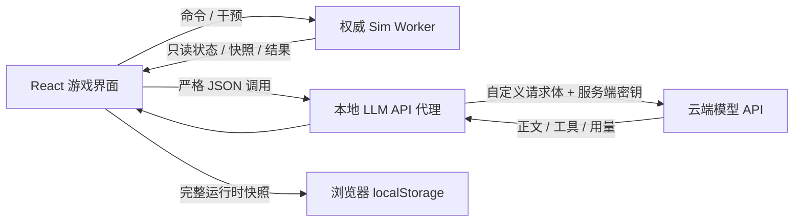

# 远穹 · 虚拟星际移民船引擎

一个面向大语言模型操控实验的单机星际移民船模拟器。

玩家签发出发地、目的地和不可忽略的“最高指令”，随后把舰内指挥权交给固定编制的 AI 舰长体系。AI 不能直接改写世界真值，只能读取获授权的观测，并通过跃迁、休眠医疗、舱区隔离、六自由度推进、电力、冷却与旋转居住环等真实接口行动；玩家则可以切换到世界之外的上帝视角，制造故障、操纵环境或直接注入物理量，观察 AI 如何在错误信息、资源约束和社会压力下维持航程。

项目的目标是“完整、宏大但可计算”的工程级虚拟飞船，而不是只有飞行数值的驾驶小游戏。设计气质接近冷峻、工业化的深空远航叙事，同时保留民用移民船中的乘客生活、医疗、休眠、治理与主观体验。

> **当前版本定位：可运行、可测试的纵切引擎，不是完整目标引擎。**
>
> 权威 Web Worker、确定性多速率核心、`2,120` 名持久人员、带供电后果的休眠流程、跃迁能量链、真实火炬推进、双反向旋转居住环、通用命令总线、外部干预账本和固定 `40` 节点 LLM 网关已经存在。48 舱大气、A/B 水回收、双回路冷却、双母线电力、六自由度刚体导航和旋转环是六个独立的权威物理域；正式 Worker 中的聚合人口采用 `external-roster` 权威模式，人员计数、健康和士气只由完整个体名册投影。完整轨道/星历、全舰结构与维修网络、完整舰内社会自治和长期涌现仍在开发；界面中出现某个目标系统，不等于该系统已经拥有最终精度的求解器。

详细需求见 [产品规格](docs/PRODUCT_SPEC.md)，分阶段技术设计见 [引擎架构](docs/ENGINE_ARCHITECTURE.md)。

## 当前可以体验什么

- 在全屏「建立最高指令」层选择出发地/目的地、编辑自然语言最高指令；未签发前侧栏禁用、事件流为空，避免误以为已在航程中。
- 以暂停与五档模拟倍率推进时间：`30m/s`（`1,800×`）、`1H/s`（`3,600×`）、`2H/s`（`7,200×`）、`6H/s`（`21,600×`）、`1D/s`（`86,400×`）；快捷键 `1`–`5` 切换倍率，`Space` 暂停/继续。
- 工作区状态条区分：推进中、等待舰长决策、缺密钥阻塞 AI、玩家暂停等。
- 观察电力、热管理、大气、六自由度导航、双反向旋转环人工重力、水、人口、休眠、外部环境和跃迁储能随时间演化。
- 让云端舰长模型根据延迟、带噪且可能故障的舰载观测向相关部门咨询，再操纵跃迁、清醒目标、舱区隔离、推进器机动、聚变堆、电网、冷却泵和居住环驱动；`32` 个固定关键乘客也会在清醒时通过受限的私人轮询表达本人体验、需求或建议。
- 让舰长模型自行调整例行系统信息周期、讨论深度和轮数；服务端仍会执行硬上限。
- 通过人工干预面板触发预设异常（包括真实居住环轴承劣化），或用“原力”直接修改受支持的物理量；破坏性操作需二次确认。
- 程序化调度器会在航程中触发叙事或物理异常；微流星体、冷却泵卡死、恒星耀斑会以 `environment:procedural` 写入真实物理账本（其余类型当前多为叙事时间线）。
- 手动保存/读取包含引擎、随机流、事件队列、干预记录与全部人员状态的本地快照（键名 `farhorizon-save`）；读档覆盖当前会话前会确认；启动卡可提示并读取已有本机存档。
- 在安全抵达后结束航程，查看客观结果和 `6` 名确定性分层代表的主观评价；代表覆盖船员/乘客、体验高低端及重大事故亲历者，项目不提供统一分数。

界面包含航程、舰体、乘员、AI 观察和人工干预五个主要视图，采用适配笔记本与 `1920×1080` 的二维工业化信息界面，不依赖重型 3D 引擎。窄屏（约 `≤1100px`）下右侧事件轨收为可开闭抽屉；顶栏可静音；最高指令条过长时可展开阅读。

## 实现边界

### 已经落地

| 领域 | 当前实现 |
|---|---|
| 权威运行时 | 独立 Web Worker 持有世界真值；React 只发送结构化命令并消费只读状态 |
| 确定性核心 | 整数微秒时钟、种子随机流、稳定事件排序、多速率系统调度、版本化快照与精确续跑；核心、人员、舱室、冷却、电力、导航、旋转、水、维修九域统一公共切片正常不超过 `60 s`，推进活动或旋转环失衡、故障、非 `speed-hold` 控制时不超过 `1 s`，导航活动积分内部细分到 `0.1 s` |
| 聚合世界 | 辐射环境、休眠、跃迁储能和航程状态；大气、热、电力与水只接受对应权威网络投影，人口计数及健康/士气均值只接受个体名册投影，不再并行求解第二份真值 |
| 水循环 | 固定 A/B 净水、废水、储备冰与浓盐水库存；两台回收机按主处理 `85%` 加浓盐水二级回收 `87%` 形成总计 `98.05%` 的两级路径，真实吞吐受指令、设备工况、对应生命保障馈线、入口库存和出口罐余量约束；生活用水、呼吸产水跨域和处理产物逐项闭合，普通 UI/LLM 只读持久化延迟仪表帧，上帝模式可跳停实体设备或审计式改写总净水库存 |
| 跃迁 | 单次 `0.1–5 ly` 的储能、热、电气和刚体姿态联锁，非线性能耗、废热沉积、分段里程与抵达判定；成功跃迁后导航建立新的本地惯性帧 epoch，清空旧帧延迟观测而不虚构冲量 |
| 人员 | 固定 `2,000` 名乘客和 `120` 名船员；生者的 `health.physical` 与 `psychology.stability` 均值是全舰健康和士气的唯一权威；每人具有稳定身份、职业技能、健康、心理、关系、记忆、固定舱位和体验维度；48 区真实压力、氧分压、二氧化碳分压与温度按五类两级阈值只作用于对应区清醒者，A/B 环重力或结构振动阈值也只写入对应清醒个体 |
| 休眠 | `2,200` 个舱位的分配约束；排程、诱导、休眠、复温、恢复观察等有持续时间的状态转换；A/B 舱群各有 `15 min` 本地维持储备，储备耗尽后的未保护暴露会累计并写入个体健康、心理、记忆和体验 |
| 乘客评价 | 基于个人经历与体验维度生成多段主观评价，不输出总分；航程报告用确定性分层规则选择 `6` 人，兼顾船员/乘客、体验高低端和最重要事故记忆 |
| 48 舱大气网络 | 舱门、风管、隔离阀、具体舱段破口、代谢交换、CO₂ 处理、自适应细分和守恒外部源汇 |
| 冷却热网 | 双回路、热节点、换热器、泵和散热器；推进、旋转驱动、跃迁、电气损耗、代谢、舰务负载与上帝注入按来源分类入账，逐负载服务功率动态形成废热；舱室热泵严格按 `Qhot = Qcold + W` 向热母线送热 |
| 电力网络 | `6` 个聚变模块、A/B 母线、断路器、分级负载和双电池；爬坡、孤岛、切负载、充放电损耗与能量对账进入权威求解，A/B 两路各 `60 MW` 推进控制负载与两路 `7.5 MW` 居住环驱动负载实际参与设备联锁 |
| 六自由度导航 | 刚体平动/转动、质量与惯性张量、姿态四元数、`18` 个有安装点的真实聚变火炬推进器；同时消耗推进剂和基线 `24 t` 聚变燃料，并分别审计源能、理想喷流能、留舰热、直排能及线/角动量；旋转环改变相对角动量时的等大反向角冲量会进入舰体状态 |
| 双反向旋转居住环 | 固定 A/B 两环各以 `224 m` 半径、`18,000 t` 质量和约 `±2 rpm` 基线运行；真实电机、馈线、轴承、摩擦与机械制动支持 `speed-hold`、`coast`、`brake`，人工重力由舰体角速度与环相对转速共同派生；角动量、机械能、耗电、废热、结构离心载荷、科里奥利系数、振动、疲劳与轴承磨损均进入权威状态或账本 |
| 有限观测 | 大气、冷却、电力、导航和旋转真值均通过有采样周期、延迟、噪声、漂移/退化、卡死或离线状态的传感器投影给 UI 与 LLM，水回收和维修资产另有持久化延迟仪表/诊断帧；“乘员”卡的舱区状态和压力只来自该舱位的延迟传感器，关键乘客私人观测也只保存脱敏区域状态/压力分档，不泄露真值；模型对旋转环只见 RPM、人工重力和振动读数，不见净环角动量、疲劳或轴承磨损真值 |
| 命令总线 | 固定 actor、角色权限、幂等键、发行时刻、期望 revision、结果审计和跨领域失败回滚；AI 工具不能绕过执行器直接改状态 |
| 维修与备件 | 固定 `8` 个可维护资产、A/B 各 `2` 台维修机器人和四类有限备件；任务创建时锁定并消耗匹配备件，自动选择一名清醒且技能匹配的真实乘员，随后按乘员熟练度与本环 `habitat-a/b` 工业馈线服务比例累计工时；断电或人员休眠会阻塞任务，只有完成后才调用所属物理域的检修接口，轴承检修保留少量历史磨损而非恢复出厂状态 |
| 上帝模式 | 外部写入先在草稿状态中原子校验；成功与拒绝都会审计，并记录声明的质量、能量、线动量和角动量差额；轴承劣化事件改变真实 A/B 环轴承条件，后续摩擦、振动、耗能和废热由求解器演化；UI 对因果事件与原力覆写要求二次确认 |
| 程序化事件 | React 层确定性调度器（固定种子，当前未写入存档）；七类事件中微流星体、冷却泵卡死、恒星耀斑经 `environment:procedural` 注入 Worker；其余类型以时间线叙事为主 |
| 固定 LLM 拓扑 | `8` 个部门 actor 与 `32` 个不可替换的关键乘客 LLM 槽位组成唯一合法的 `40` 节点拓扑；生产路径会调用舰长、按需部门顾问和符合条件的关键乘客；运行时不能创建、克隆、删除或提升代理 |
| 关键乘客轮询 | 每人维护延迟 `300` 仿真秒才发布的 `published`/`pending` 脱敏分档观测，只轮询清醒者；默认个人周期 `12 h`、有效下限 `6 h`，全局至少间隔 `15 min` 仿真时间和 `15 s` 墙钟，每仿真日最多 `64` 次尝试且同一时刻只调用 `1` 人；客户端 `30 s` 超时，失败后指数退避 |
| LLM 网关 | 自定义 HTTP 请求体、环境变量密钥引用、JSON/SSE/NDJSON 映射、指数退避持续重试、取消与用量统计；密钥头强制 HTTPS，普通 HTTP 仅允许无密钥的回环地址，URL 凭据和普通敏感头会在联网前拒绝；每次尝试有超时和响应总字节上限，JSON 与两种流均有界读取；公开写路由只接受同源回环请求，`passenger-self` 使用严格 DTO 并由服务端固定 `passenger-service → 目标乘客` 身份 |
| 舰长闭环 | 任务开始、例行周期、跃迁就绪和关键报警可触发舰长及相关部门；等待时暂停模拟；舰长每轮最多提交 `8` 条世界工具，按顺序进入串行队列，并把每条结构化设备回执带入下一轮观察 |
| 本地存档 | 浏览器 `localStorage` 键 `farhorizon-save`；外层封装 `v18` 内含运行时快照 `v15` 和关键乘客轮询快照 `v2`；仅手动存读（读档确认覆盖）；保存先暂停新步进/模型调用，等待在途物理事务原子完成再取 Worker 安全点；除权威世界外还保存轮询游标、预算、含固定舱区观测的 `published`/`pending`、个人调度及本人私人 note；聚合核心、人员、舱室、冷却、电力、导航、旋转、水、维修子域快照分别为 `v6`、`v2`、`v3`、`v5`、`v4`、`v5`、`v1`、`v1`、`v1` |
| 游戏界面 | 全屏签发层、五主视图（舰体为 `detail-view`/`topology-grid`）、工作区状态条、事件过滤与窄屏抽屉、警报横幅、API 状态、上帝/读档确认、乘员关键槽位诚实空态、静音与快捷键提示、可展开最高指令、可关闭持久 Toast、抵达报告；全舰事件时间线最多保留最近 `500` 条 |

### 仍属于目标架构

- 真实星表/星历、天体引力、轨道机动和移动载荷引起的质心迁移；当前跃迁后会正确重基准本地惯性帧 epoch，但这不等同于真实天体坐标与局部六自由度轨迹的完整衔接。
- 在已经接通的电力→冷却/休眠/推进控制、逐负载废热、舱室热泵、分区急性环境后果和首批设备维修任务之外，继续深化设备失供到人员的长期后果；逐段液体管路、结构、门禁、机器人移动路径、制造和通用备件替代网络仍未实现。
- 旋转居住环的降阶角动量、轴承/制动、人工重力、结构离心载荷、科里奥利系数、疲劳与磨损已经接通；重力或结构振动首次跨越分级阈值时，会按 A/B 环位置影响当时清醒乘员的健康、心理、体验和个人记忆，且同一危险带内不会按每个物理子步重复处罚。可移动配平质量、局部结构连接/裂纹、轴承维修过程、长期重力剂量和完整科里奥利行为后果仍属于目标。
- 火灾、烟雾、污染、裂纹、疲劳、辐射损伤、医疗资源和制造流程的局部高精度模型。
- 分区 CO₂ 洗涤器、补气歧管、湿度控制、火灾/烟雾传播与热网之间更细的设备级耦合。
- 部门咨询目前围绕舰长关键事件展开；关键乘客当前只有单人、只读、私人且低频的本人轮询。通用收件箱、跨乘客长期记忆、任意合法通信边上的受限嵌套讨论，以及完整舰内社会自治仍属于目标，不能由这条私人轮询链路推断为已经存在。
- `2,120` 人的长期连续剂量、治疗、完整生理演化、真实位置移动、空间可达行动、家庭与组织行为、冲突和长期社会涌现；当前分区环境后果仅在阈值进入/升级时触发，休眠者不按固定 cabin 承受这条清醒暴露链。
- 多段航线规划、真实星表/星历、常规推进与真实轨道/航路的衔接、改道和安全港；当前跃迁设备联锁已经接通，但还不是完整航路规划器。
- 自动存档、IndexedDB、大型增量日志、存档迁移、外部 LLM 响应重放和航程分段归档。
- 长航程守恒漂移测试、性能压力测试、完整端到端事故场景和系统化视觉回归。

当前运行时拓扑固定为舰长、导航、工程、生命保障、医疗、乘客事务、安全和乘客服务 `8` 个部门 actor，以及持久名册中的 `32` 个固定关键乘客 LLM 槽位。舰长在关键事件中会按领域主动咨询部门；清醒的关键乘客由单并发、轮转限额的调度器逐人轮询，而不是 `40` 路常驻并发。乘客回复只回到本人的私人记录并显示在“乘员”页，不进入全舰时间线，也不写入物理世界、体验维度或其他人的上下文，因此不代表完整部门组织和社会已经自治。任何岗位和关键槽位都不能在航程中创建、克隆、删除或临时提升。

## 快速启动

### 环境要求

- Windows、macOS 或 Linux
- Node.js `>= 22.13.0`
- npm
- 如需 AI 实际接管：至少一个兼容 HTTP JSON 或流式响应的云端模型 API

### 安装与运行

```powershell
npm install
Copy-Item .env.example .env.local   # macOS/Linux: cp .env.example .env.local
npm run check:env                   # 可选：检查 Node 版本与密钥是否齐全（不打印密钥）
npm run dev
```

开发服务器通常运行在 [http://localhost:3000](http://localhost:3000)，请以终端实际输出为准。

不配置 LLM 也可以启动界面、运行确定性模拟、使用存档和人工干预；AI 页面会把缺少密钥的岗位标为 `missing-secret`，工作区状态条会提示「关键 AI 决策等待本机 LLM 密钥」，舰长自动决策不会启动。签发层也会给出配置指引。

如果使用 DeepSeek，可在项目根目录放置一个被 Git 忽略的本地 `.txt` 凭据文件，内容只需包含 `Base URL: https://api.deepseek.com` 与 `API Key: ...` 两行，然后运行：

```powershell
npm run dev:deepseek
```

该跨平台启动器（`scripts/start-deepseek.mjs`）会在内存中构造完整 `40` 槽配置，把同一密钥映射到八个部门及其关键乘客槽位，并设置 `CLOUDFLARE_INCLUDE_PROCESS_ENV=true` 以便 vinext/Cloudflare 开发运行时转发进程环境变量；它不会生成含密钥的 dotenv 或 JSON 文件。可用参数示例：

```powershell
node scripts/start-deepseek.mjs --port=3000 --model=deepseek-v4-flash --thinking=disabled
```

Windows 也可使用 PowerShell 备选入口：`npm run dev:deepseek:ps1`（`scripts/start-deepseek.ps1`）。终端只显示供应商域名、模型与槽位数，不打印密钥。

### 生产构建

```powershell
npm run build
npm run start
```

这是本地单机应用。当前不需要数据库、账号系统或外部消息队列。

## 配置云端 LLM

默认会加载 [config/llm.example.json](config/llm.example.json)。这个文件中的域名是故意不可用的示例地址，必须先替换模型端点；不要只填写密钥后直接使用示例端点，否则关键调用会进入持续重试并保持模拟暂停。

配置有两部分：

1. `LLM_CONFIG_JSON`：完整的固定岗位、端点、请求模板与响应映射。留空时使用仓库中的示例配置。
2. 密钥环境变量：由每个 `secretHeaders[].secretRef` 指定。密钥永远不应写进 JSON 配置、普通请求头或浏览器代码。

默认八个岗位使用 `.env.example` 中的这些变量：

```dotenv
SHIP_CAPTAIN_LLM_API_KEY=
SHIP_NAVIGATION_LLM_API_KEY=
SHIP_ENGINEERING_LLM_API_KEY=
SHIP_LIFE_SUPPORT_LLM_API_KEY=
SHIP_MEDICAL_LLM_API_KEY=
SHIP_PASSENGER_AFFAIRS_LLM_API_KEY=
SHIP_SECURITY_LLM_API_KEY=
SHIP_PASSENGER_SERVICE_LLM_API_KEY=
```

当前 UI 以规范 `40` 节点拓扑全部通过配置校验作为自动闭环的就绪条件。默认配置会从八部门模板显式扩展出 `32` 个关键乘客槽位，这些槽位复用乘客服务端点，因此仍只需填写上列八个部门密钥；同一供应商允许多个岗位引用同一个实际密钥，但仍建议保留不同的环境变量名，便于独立计费、限流和撤销。

### 自定义请求体与 Thinking

不同供应商不必采用同一套请求格式。每个岗位的 `endpoint.bodyTemplate` 都是完整 JSON 模板，因此 Thinking 开关、推理预算、模型名、工具字段甚至消息封装都可以按供应商要求编排：

```json
{
  "endpoint": {
    "url": "https://provider.example/v1/chat/completions",
    "method": "POST",
    "requestTimeoutMs": 120000,
    "maxResponseBytes": 4194304,
    "headers": {
      "x-ship-client": "ship-y/llm-gateway-v1"
    },
    "secretHeaders": [
      {
        "header": "authorization",
        "secretRef": "SHIP_CAPTAIN_LLM_API_KEY",
        "prefix": "Bearer "
      }
    ],
    "bodyTemplate": {
      "model": "reasoning-model",
      "messages": "{{request.openAiMessagesWithSystem}}",
      "tools": "{{request.openAiTools}}",
      "thinking": {
        "enabled": true,
        "budget_tokens": 8192
      },
      "stream": false
    },
    "response": {
      "kind": "json",
      "textPath": ["choices", 0, "message", "content"],
      "toolCallsPath": ["choices", 0, "message", "tool_calls"],
      "toolCall": {
        "idPath": ["id"],
        "namePath": ["function", "name"],
        "argumentsPath": ["function", "arguments"]
      },
      "usage": {
        "inputTokensPath": ["usage", "prompt_tokens"],
        "outputTokensPath": ["usage", "completion_tokens"],
        "totalTokensPath": ["usage", "total_tokens"]
      }
    }
  }
}
```

> `config/llm.example.json` 使用上表这类供应商无关的 `thinking` 对象。DeepSeek 启动器会把它覆写为 `{ "type": "enabled"|"disabled" }`，并在启用时附加 `reasoning_effort`；请以目标供应商文档为准，不要混用两套字段。

带 `secretHeaders` 的端点必须使用 HTTPS；不带密钥的明文 HTTP 只允许精确的 `localhost`、`127.0.0.1` 或 `[::1]` 回环主机。URL 用户名/密码，以及名称含认证、Cookie、session、credential、token、secret 等语义的普通 `headers` 都会在发起网络请求前被拒绝。`requestTimeoutMs` 默认 `120 s`、绝对上限 `600 s`；`maxResponseBytes` 默认 `4 MiB`、绝对上限 `16 MiB`，并按每次重试尝试分别计时和计数。

模板可读取以下变量：

| 变量 | 内容 |
|---|---|
| `agent.id` / `agent.role` / `agent.systemPrompt` | 当前固定岗位定义 |
| `request.messages` | 不含系统提示的调用消息 |
| `request.messagesWithSystem` | 已插入该岗位固定系统提示的消息 |
| `request.openAiMessages` / `request.openAiMessagesWithSystem` | OpenAI 兼容消息；结构化 `content` 会先序列化为 JSON 字符串 |
| `request.tools` | 引擎内部工具定义 |
| `request.openAiTools` | 转换为常见 function-tool 结构的工具定义 |
| `request.metadata` | 本次调用的非权威元数据 |
| `request.stream` | 响应映射是否配置为流式 |
| `routine.*` | 当前系统信息周期、讨论深度和轮数 |

当一个字符串完全由 `{{...}}` 占据时，数组、对象、布尔值和数字会保留原本的 JSON 类型；嵌在普通文本中的变量会转为字符串。

响应可以配置为：

- `kind: "json"`：用 JSON 路径映射正文、结束原因、工具调用和 token 用量。
- `kind: "stream", format: "sse"`：解析 Server-Sent Events。
- `kind: "stream", format: "ndjson"`：解析逐行 JSON。

流式配置还可以指定 `dataPrefix`、`doneSentinel`、`doneWhen` 和 `acceptEof`。JSON、SSE 和 NDJSON 都按原始响应累计字节有界读取；超时、中断或累计超限时会取消本次 reader，不把半截正文或工具参数交给引擎，而是丢弃本次部分结果后重试。玩家或上层调用者的 `AbortSignal` 仍可终止整个持续重试过程。

如果不想把较长 JSON 填入 `.env.local`，可以在启动当前 PowerShell 会话时压缩一个放在仓库外的私有配置：

```powershell
$env:LLM_CONFIG_JSON = (
  Get-Content -Raw "C:\private\ship-llm.json" |
  ConvertFrom-Json |
  ConvertTo-Json -Depth 100 -Compress
)
npm run dev
```

密钥仍应放入 `.env.local` 或当前进程的环境变量，不要放进 `ship-llm.json`。

## 一次航程如何运行

1. 选择出发地与目的地。
2. 输入最高指令。它是任务契约，不会赋予 AI 违反物理或调用上帝接口的能力。
3. 签发指令并起航。Worker 会用场景种子建立确定性世界和完整人员名册。
4. 观察舰长根据任务开始、例行周期、跃迁就绪或关键报警获得新的传感器包，并按事件类型向导航、工程、生命保障或医疗等固定部门请求有限观测下的建议；关键乘客调度器同时为每人维护延迟 `300` 仿真秒的脱敏本人观测，并只从清醒且到期者中轮转选择一人。
5. 舰长可以返回文字说明，并在一轮中选择最多 `8` 条当前开放的世界内工具：
   - 航程与医疗：`execute_jump`、`set_awake_target`、`isolate_pressure_zone`。
   - 常规推进：`schedule_thruster_pulse` 或原子提交多脉冲的 `schedule_thruster_maneuver`；最终力和力矩由安装点、节流、持续时间、推进剂、聚变燃料、A/B 控制列车供电、质量与惯性共同决定。
   - 工程控制：`set_reactor_target`、`set_reactor_mode`、`set_cooling_pump_speed`、`set_electrical_load_enabled`、`set_electrical_breaker`、`set_battery_mode`、`set_habitat_ring_control`。居住环只能命令真实驱动器保持转速、滑行或制动，不能直接指定人工重力。
   - 维修：`schedule_maintenance` 只接受固定资产 ID；它创建消耗备件、占用机器人与合格清醒乘员的耗时任务，不能直接把故障状态改为正常。
   - 自我调度：`configure_self_routine` 由服务端注入并使用一次性票据，只允许模型调整自己的例行周期和讨论上限。
6. 世界内命令按固定角色授权：导航可跃迁和排程推进机动；工程可操作聚变堆、冷却泵、电力负载、断路器、电池、居住环驱动、A/B 空气处理机并创建维修任务；医疗可调整清醒目标；生命保障可操作空气处理机，生命保障与安全可隔离压力区；舰长拥有上述权限。乘客事务与乘客服务目前只有观察/沟通职责，没有物理命令白名单。
7. 合法世界工具不会并发乱序写入 Worker，而是按模型返回顺序进入串行队列；每条都会形成包含工具 ID、命令类型、接受/拒绝状态和摘要的结构化设备回执，供下一轮舰长判断，超过八条的部分明确记为未入队。
8. 等待关键 LLM 响应和舰长串行命令队列时，模拟时间暂停，界面和 API 状态继续响应。关键乘客调用另有 `30 s` 客户端上限、单并发、每日预算和失败指数退避；它的私人回复不产生世界命令。网关使用有上限的指数退避持续重试，每次网络尝试仍受独立超时和响应字节上限约束。
9. 玩家可以只观察，也可以进入人工干预模式（需确认），从世界外制造变量，检验舰长的诊断与恢复能力；航程中程序化异常也可能注入真实物理后果。
10. 最后一段跃迁安全抵达后，航程结束并移交人类驾驶，不继续模拟着陆和殖民。

模型返回的隐藏思维过程不会显示、保存或作为控制依据；界面只呈现模型明确返回的正文、工具调用结果、状态和用量。

## 上帝模式与物理因果

项目刻意保留两种完全不同的权力：

### 世界内行动

舰长、部门、乘客、船员和机器人必须遵循：

```text
意图
  -> 权限检查
  -> 控制命令
  -> 联锁或覆盖流程
  -> 执行器/人员
  -> 物理求解
  -> 传感器
  -> 角色认知
```

例如舰长不能把温度直接设成 `22 °C`，只能操作存在的设备；不能“恢复健康”，只能发起诊断、给药、手术或休眠流程。

### 世界外干预

只有玩家的上帝模式可以绕过上述链路。直接注入仍会：

- 经过类型、范围和跨字段不变量校验；
- 以原子事务应用，非法状态不会留下半次修改；
- 记录修改前后值、原因、时间和状态修订号；
- 声明外部带入或带走的质量、能量、线动量与角动量；
- 不向舰内 AI 自动解释“玩家做了什么”。

微流星事件会在 `A-18` 建立真实破口，由舱段求解器计算气体外逸；声明的外部线/角动量也会进入六自由度导航状态。冷却泵故障作用于真实泵实体，聚变堆保护跳闸作用于真实反应堆及断路器，居住环轴承劣化预设会把 A 环的真实轴承条件改为 `degraded`，空气处理机跳停会把 A 机实体置为 `stuck-off`；随后由各自求解器和延迟传感器呈现后果。恒星耀斑和乘客急症仍主要通过环境与人员纵切表达，全舰结构损伤和完整个体医疗流程还需继续深化。

当前跨域纵切已经包含几条可对账的真实因果链：电网按负载 ID 向冷却泵、休眠 A/B 舱群、两台空气处理机、两路 `60 MW` 推进控制列车和两路 `7.5 MW` 居住环驱动提供服务能量。A/B 空气处理机各固定服务本环 24 区，实际循环风量由风量指令、设备状态和本侧馈线服务比例相乘得到；它只缩放风管强制混合，不会抹掉门/阀压差流。CO₂ 吸附器只从本环实体舱室中按可移除质量比例捕获高于 `80 Pa` 控制设定点的 CO₂，受 `0.09 kg/s` 单机额定能力限制，并把累计捕获质量纳入恢复对账，不能全局删数或抽到绝对零。火炬只有在对应控制列车供能和点火条件满足时才工作，同时消耗推进剂与聚变燃料。源能会闭合为理想喷流能、留舰废热和直排能，留舰热连同控制能进入热网的 `propulsion` 分类。环驱动的电机功、轴承摩擦和制动改变环的相对角动量与机械能，等大反向角冲量及舰体机械能转移进入导航，耗散热进入热网的 `rotation-drive` 分类。舱室热泵从乘员环境移走的 `Qcold` 加上压缩机功 `W`，以 `Qhot = Qcold + W` 注入热母线；其他已服务负载按各自热化比例动态产生舰务废热。48 舱真值中的低压、低氧、高二氧化碳、寒冷和高温进入两级风险带时，只向固定舱位落在该区的清醒者写入急性健康、心理、体验和记忆后果；每区每类风险的 `currentTier + episode` 一同持久化，同一 episode 内幂等，退出后再进入才开启新 episode。快照恢复会交叉核对电力→推进→热网、电力→环驱动、环反作用→导航、环耗散→热网、空气处理捕集账与聚合大气，以及聚合人口计数/均值与人员名册，不能只让各子域分别“看起来合法”。

稳定航行时，48 舱网络使用守恒的平衡态快速路径；出现破口或实体故障时会自动切换到 `100 ms` 级瞬态细分，并把请求的高倍速暂时限到最高 `60×`。这避免 `21,600×` 快进越过事故过程，也保证浏览器 Worker 不被一次数分钟的细分计算阻塞。

Worker 的九个权威域始终在同一个公共时钟边界提交：正常航行单片不超过 `60 s`，有推进活动，或旋转环失衡、设备故障、处于非 `speed-hold` 控制时不超过 `1 s`，推进边界也会提前切片；导航求解器在活动推进片内继续使用 `0.1 s` 物理子步。跃迁完成后只把局部位置原点和导航—旋转交换账本基线重置到新的 frame epoch，保留速度、姿态、角速度、环速、质量、磨损和库存，并丢弃上一 epoch 的延迟导航样本；这是一致的局部坐标重基准，不是尚未实现的真实星历传播。

## 物理真实性原则

本项目所说的“真实”不是在浏览器中强行运行整船 CFD 或全尺寸有限元，而是：

- 使用 SI 单位和可验证的工程降阶模型。
- 局部事故提高时间与空间分辨率，稳定区域使用守恒的快速路径。
- 质量、能量、动量、气体组分和人员状态不因降频凭空出现或消失。
- 传感器读数与世界真值分离，允许噪声、偏差、漂移、延迟、卡死、离线和互相冲突。
- 未来科技也有实体部件、容量、效率、响应时间、能耗、废热、磨损、联锁和失败模式。
- 跃迁是唯一明确的虚构物理扩展；“技术成熟”表示可标准化运行，不表示免费、瞬时准备或永不故障。
- 确定性承诺为：相同版本、相同快照、相同有序外部输入，得到相同后续状态与事件。

云端模型响应天然不确定。要完整重放含 LLM 的历史，未来存档系统还需要记录已接受的模型响应；当前快照主要保证本地物理、人员、队列和随机流的确定性续跑。

## 运行架构



- **React 主线程**负责界面、外部 LLM 协调和本地存档 I/O，不拥有物理世界真值。
- **Sim Worker**是唯一物理状态写入者，负责时间、调度、系统更新、人员、命令和外部干预。
- **本地 API 代理**校验调用、解析供应商响应并保护 API 密钥。
- **云端模型**被视为可能迟到、失败和产生非法输出的不可信外部效果。

为了保持轻量，当前没有引入 Redux、通用 ECS、微服务、消息中间件、数据库服务或 WASM。只有性能数据证明 TypeScript Worker 不足时，才应替换局部求解器。

## 目录

```text
app/
  page.tsx / layout.tsx / globals.css   入口、根布局与工业 HUD 样式
  mission-control.tsx                   游戏总控：Worker 桥接、舰长协调、存档与 UX 状态
  api/llm/                              状态、调用和一次性自管理票据 API
  ui/
    views/                              航程 / 舰体 / 乘员 / AI / 上帝 五视图
    components/                         星图、拓扑、API 状态、警报等
    procedural-events.ts                程序化事件调度（部分接物理）
    use-audio.ts                        合成音效与静音
    constants.ts / types.ts / utils.ts  UI 常量、类型与格式化

config/
  llm.example.json                      八部门模板及规范 40 节点展开规则的供应商无关示例

lib/
  sim/index.ts                          确定性核心与聚合系统
  sim/worker.ts                         权威仿真 Worker 与九时钟原子耦合
  sim/water.ts                          A/B 两级水回收、质量账与延迟仪表
  sim/maintenance.ts                    维修机器人、工时、技能、备件与延迟诊断
  sim/protocol.ts                       UI 与 Worker 的结构化协议
  sim/command-bus.ts                    固定 actor 权限、幂等、revision 与审计
  sim/passengers.ts                     2,120 人名册、休眠与体验
  sim/compartments.ts                   48 舱大气、连接、破口和传感器网络
  sim/cooling.ts                        双回路热节点、泵、换热器与散热器
  sim/electrical.ts                     聚变堆、双母线、断路器、负载与储能
  sim/navigation.ts                     六自由度刚体、推进器与导航传感器
  sim/rotation.ts                       双反向旋转环、驱动/轴承/制动与传感器
  llm/index.ts                          固定注册表、模板、解析、重试与用量
  llm/fixed-topology.ts                 40 节点拓扑展开与校验
  llm/key-passenger-polling.ts          关键乘客延迟观测、预算、调度与快照

scripts/
  start-deepseek.mjs                    跨平台 DeepSeek 一键启动（推荐）
  start-deepseek.ps1                    Windows PowerShell 备选启动器
  check-env.mjs                         Node / LLM 配置就绪检查（不打印密钥）

tests/
  sim/                                  核心、人员、六个权威物理域与 Worker 测试
  llm/                                  网关、服务端运行时和 API 路由测试
  rendered-html.test.mjs                构建后页面与产品骨架检查

docs/
  PRODUCT_SPEC.md                       完整产品与世界规则（区分已实现/目标）
  ENGINE_ARCHITECTURE.md                目标架构、性能预算和分阶段路线
```

## 测试与质量检查

```powershell
# 检查 Node 版本与 LLM 密钥是否齐全（不打印密钥值）
npm run check:env

# 只运行 Node 单元与路由测试
npm run test:unit

# TypeScript 静态检查
npm run typecheck

# ESLint
npm run lint

# 先完成生产构建，再运行全部 Node 测试
npm test

# 类型、Lint、构建和测试的完整门禁
npm run check
```

当前测试覆盖：

- 种子随机流和快照恢复的确定性；
- 同时刻事件的稳定排序和多速率系统边界；
- 上帝干预的原子性、拒绝审计和外部守恒账本；
- 跃迁耗能、废热和航程推进；
- `2,120` 人固定名册、不可替换的 `32` 名关键人员、休眠状态机，以及生者健康/士气均值作为唯一人口权威；
- 五类两级分区环境事件的清醒者定向后果、episode 幂等与恢复校验，乘客事件记忆及确定性分层的无分数主观评价；
- 48 舱气体守恒、A/B 两级水回收及呼吸产水跨域质量账、双回路热量搬运、热泵 `Qhot = Qcold + W`、逐负载废热、电网功率/能量分配、六自由度动量、火炬推进剂/聚变燃料/源能分账，以及双反向旋转环的人工重力、被动滑行、供电保持、制动反作用、角动量/能量闭合和各域延迟/噪声/故障传感器；
- 运行时快照 `v15`、本地存档 `v18`、关键乘客轮询快照 `v2`、聚合核心 `v6`、人员 `v2`、舱室 `v3`、冷却 `v5`、电力 `v4`、导航 `v5`、旋转 `v1`、水 `v1`、维修 `v1`，以及 Worker 九时钟、名册人口权威、维修资源/任务账、空气处理捕集账、水库存/处理账和电力→推进→热网、电力→环驱动→导航/热网恢复对账、恢复原子性、事故限速与跨域原力同步；
- 固定八 actor 的命令权限、幂等/revision 审计、未来命令拒绝和执行失败全域回滚；
- 固定 `40` 节点 LLM 拓扑、通信权限、自主管理上限、自定义模板与响应映射；
- 关键乘客 `300 s` 延迟分档观测、只轮询清醒者、轮转/周期/墙钟/日预算约束、失败退避、私人 note、快照恢复和上帝干预防迟到响应；
- HTTPS/回环、同源写路由、严格 `passenger-self` DTO、服务端身份绑定、敏感头前置策略、请求超时、JSON/SSE/NDJSON 响应字节上限、持续重试、流中断丢弃、一次性票据和输入安全校验；
- 生产构建能够服务真实任务界面（含签发层、Worker 桥接与工业 HUD 骨架），并包含 Worker-backed 模拟器。

程序化事件调度器与窄屏事件抽屉等 UX 细节以手工验收为主；`tests/rendered-html.test.mjs` 会断言关键 shell 文案与 CSS 骨架类名存在。

## 数据、安全与费用

- 所有游戏存档目前保存在当前浏览器配置文件的 `localStorage` 键 `farhorizon-save` 中（外层 `version: 18`），不上传到项目服务器，但也**没有加密**。能访问该浏览器配置文件的人可以读取或删除它。当前仅支持手动存读；读档会覆盖当前会话并弹出确认。
- API 密钥只从服务端环境变量解析。敏感头不能写入普通 `headers`；配置解析器要求通过 `secretHeaders` 引用环境变量。
- 携带 `secretHeaders` 的端点必须使用 HTTPS；HTTP 只允许不带密钥的精确回环主机，URL 内嵌凭据会被拒绝。每次供应商请求都有绝对超时和响应总字节限制，避免挂起或无限流占用内存。
- `/api/llm/status` 不返回系统提示词、密钥值或密钥变量名。
- LLM 调用体仅接受严格 JSON，限制为 `1 MiB`；客户端不能注入 `system` 角色、创建运行时代理或直接提交服务端自管理工具。
- LLM 写路由只接受同源浏览器发出的回环请求。`passenger-self` 只接受该乘客本人的脱敏分档 DTO，服务端固定发送者为 `passenger-service`、接收者为目标固定身份，并把乘客调用并发硬限制为 `1`。
- 关键乘客回复最多保留为该乘客自己的私人 note，只在对应“乘员”页卡片显示；不会进入最多 `500` 条的全舰事件时间线，不会下达工具，也不会修改世界状态、个人体验或其他乘客资料。
- 模型只能获得调用中明确提供的最高指令、事件和授权观测。它不会自动读取 Worker 内的完整世界真值或玩家上帝操作说明。程序化物理异常同样不向 AI 自动解释来源。
- 发送给模型的内容、供应商日志保留策略和地域合规由你配置的云端 API 决定。请不要在最高指令或模型消息中放入真实个人隐私。
- 持续重试会让关键决策期间的模拟保持暂停。供应商若按请求或 token 计费，失败重试和多岗位调用可能产生费用；AI 观察页会显示当前会话的 token 汇总和岗位就绪/重试状态，但它不是账单系统。
- 当前没有登录、权限隔离或多用户租户边界，只适合可信本机上的单人使用。

`.env.local` 已被 Git 忽略；提交前仍应检查变更，确认没有把密钥复制到源码、配置示例、日志或存档中。可用 `npm run check:env` 确认密钥是否齐全（不会打印密钥值）。

## 目标基准船

完整目标中的“远穹号”是一艘原创民用星际移民船：

| 项目 | 目标基线 |
|---|---|
| 人口 | `2,000` 名乘客 + `120` 名船员 |
| 舰体 | 长约 `820 m`、最大宽度约 `470 m` |
| 居住区 | 两组反向旋转环，平均半径约 `224 m`，约 `2 rpm / 1 g` |
| 加压空间 | `48` 个压力区，目标加压体积约 `450,000 m³` |
| 动力 | 聚变主动力、电推进、姿态推进和应急备份 |
| 跃迁 | 成熟船载技术，常规单段约 `3–5 ly`，准备与冷却需真实时间 |
| 自主性 | 在无法补给时维持多年生存、维修和治理 |
| 任务边界 | 不进行舰际战争；安全抵达后由人类接管，游戏航程结束 |

这些是产品基线，不代表当前版本已经求解了每一项几何、结构和推进细节。任何为了演示效果而加入的数字，最终都必须能被模块清单、资源库存和守恒模型反推。

## 开发原则

1. 先建立可验证的因果链，再增加表现层。
2. 以真实代码能力而非 UI 文案判断完成度。
3. 保持单体、Worker、原生 `fetch` 和少量依赖；不为“显得专业”引入复杂基础设施。
4. 每个新增系统至少具有状态、过程、失败方式、守恒边界、快照格式和测试。
5. 固定 LLM 拓扑不可在运行时创建、复制或销毁；更高自由度来自可用工具与沟通，而不是绕过世界规则。
6. 正常玩家只观察 AI 的输入、输出、工具和状态；不能修改模型记忆、系统提示、权限或收件消息。
7. README、规格和界面必须持续区分“已经实现”与“计划实现”。
