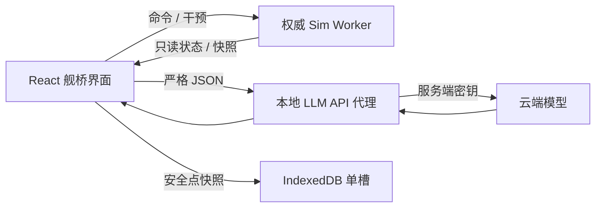

# 远穹

让 AI 舰长在真实物理约束下，带领 `2,120` 人完成一次星际移民航程。

《远穹》是单机、交互式、LLM 驱动的星际移民船模拟器。玩家签发航程与最高指令；舰长与部门 AI 只能通过传感器、权限、控制器和真实设备行动，不能直接改写世界真值。玩家也可站到世界之外，用人工干预检验诊断、决策与恢复。

> 当前是可运行、可测试的**工程因果纵切**，不是完整飞船引擎。
>
> 本地仓库是最高优先级事实源；线上部署与旧存档不能反向覆盖本地源码或文档。

## 一眼看懂

| 项目 | 当前实现 |
|---|---|
| 人口 | `2,000` 乘客 + `120` 船员，均为持久个体 |
| 舰体 | `48` 压力区（含 `ZoneRole` 功能区带）、A/B 水回收与配水支路、双回路冷却与居住热支路、双母线电力 |
| 航行 | 六自由度刚体、火炬推进、跃迁联锁、双反向旋转环；日心星表欧氏航距（单段 ≤ `5 ly`） |
| AI | `8` 部门 + `32` 关键乘客 = `40` 固定舰内节点；舰长周期精确冻结 |
| 角色 | 舰长有跨周期航行志与自设观察哨；部门有持久立场与正式异议；关键乘客有关系圈、群体情绪、传言与申诉权 |
| 界面 | 舰桥 / 舰务 / 乘员 / AI 观察 / 人工干预；告警可定位到区检查器；航行志与异议可读 |
| 时间 | `1×` … `1D/s` 七档；时钟线性插值；舰长截止点精确切片 |
| 存档 | IndexedDB 单槽手动存读（旧 `localStorage` 启动时一次性迁入；失败可回退 LS） |
| 格式 | 外层 LocalSave `v22`；Worker 运行时 `v18`；关键乘客轮询 `v2`；水 `v3`；冷却 `v6`；维修 `v3`；舰长运营 `v3` |

## 现在可以做什么

- 在授权台选起点、终点，签发最高指令；航路按星表欧氏距离估算最少跃迁段数。
- 在舰务查看区带用途、破口、水/热支路状态；未联机不显示虚构 MW/g。
- 从前向主视窗、任务相位、跃迁进度与舰桥日志掌握航程。
- 观察电力、热、大气、水、导航、旋转环、休眠与生存资源共同演化；制氧只入舰载储备，舱区补给须另下命令。
- 舰长在决策截止点取得授权观测包（传感 / 指令态 / 舰务账本分栏标注，含壳体联锁）；失败不推进日程。
- 读舰长自己写的航行志：它每个周期记下判断、在等什么、担心什么，下个周期它自己会看见——包括看见自己上次判断错了。
- 看部门当面反驳彼此、并对舰长留下正式异议；舰长有权坚持，但异议进入永久记录。
- 听关键乘客说话：他们知道家人朋友的大概状况、周围区带的气氛，会传播未经证实的传言，也会向舰务申诉队列立案。
- 用人工干预制造破口、支路故障或外部环境变化，并用「定位」跳到责任区。
- 七档时间倍率（快捷键 `1`–`7`，`Space` 暂停）与完整手动存读档。

无 LLM 密钥也可跑确定性模拟、存档与干预；需要 AI 的环节会明确显示等待配置。

## 快速开始

需要 Node.js `>= 22.13.0` 与 npm。

```powershell
npm install
npm run check:env
npm run dev
```

开发地址通常是 [http://localhost:3000](http://localhost:3000)。

### DeepSeek

在项目根目录创建已被 Git 忽略的 `deepseek-credentials.txt`：

```text
Base URL: https://api.deepseek.com
API Key: <你的密钥>
```

```powershell
npm run dev:deepseek
```

可选：`node scripts/start-deepseek.mjs --port=3000 --model=deepseek-v4-pro --thinking=disabled`

### 生产构建

```powershell
npm run build
npm run start
```

不依赖数据库、账号系统或外部消息队列。密钥与其它模型配置见[本地开发手册](docs/LOCAL_DEVELOPMENT.md)。

## 一次航程如何运行

1. 玩家选择出发地、目的地并写下最高指令。
2. Worker 按种子建立世界、名册、事件队列与各物理域。
3. 世界线性推进，在舰长下一决策截止点精确停下并冻结。
4. 同刻按需咨询部门；舰长最多 `8` 条世界命令，经权限 → 执行器 → 物理求解后才解冻。
5. 玩家可观察、暂停、快进、保存，或注入经审计的人工干预。
6. 末段跃迁安全完成后生成抵达报告。

```text
意图 → 权限 → 控制命令 → 联锁 → 执行器/人员 → 物理求解 → 传感器 → 认知
```

## 运行架构


```mermaid
flowchart LR
    UI["React 舰桥界面"] -->|"命令 / 干预"| W["权威 Sim Worker"]
    W -->|"只读状态 / 快照"| UI
    UI -->|"严格 JSON"| API["本地 LLM API 代理"]
    API -->|"服务端密钥"| CLOUD["云端模型"]
    CLOUD --> API --> UI
    UI -->|"安全点快照"| SAVE["IndexedDB 单槽"]
```

- **React**：界面、LLM 协调、存档 I/O；不拥有物理真值。
- **Sim Worker**：唯一世界写入者（时间、命令、物理、人员、干预）。
- **API 代理**：校验请求、护密钥、适配供应商协议。
- **云模型**：不可信外部效果；网关默认最多重试 `6` 次。

## 当前边界（摘要）

| 已落地 | 尚未完成 |
|---|---|
| 十域确定性 Worker、ZoneRole 区带、水/热可故障支路 | 通用设备级管网、全舰结构、火灾烟雾 |
| 日心星表欧氏航距与最少跃迁段 | 完整星历、轨道机动、安全港 |
| 舰长鲁棒调度、混合观测通道、软失败命令队列 | 通用收件箱、外部响应重放 |
| 舰长记忆与自设注意力、部门异议记录、乘客申诉闭环与传言 | 部门自发通信、普通乘客自主行为、异议自动判定 |
| IndexedDB 手动单槽 + LS 迁移 | 自动/轮换存档、checksum 全链 |
| 破口事故剧本、长航程守恒烟雾测试 | 系统化视觉回归、付费云模型烟雾 |

版本矩阵、验证结果与细节以[当前实现状态](docs/PROJECT_STATUS.md)为准。目标需求见[产品规格](docs/PRODUCT_SPEC.md)，技术路线见[引擎架构](docs/ENGINE_ARCHITECTURE.md)。

## 项目结构

```text
app/          舰桥 UI、路由、本地 LLM API
lib/sim/      确定性核心与权威物理域
lib/llm/      固定拓扑、网关、Prompt、轮询
lib/astro/    日心星表与航距
lib/persist/  IndexedDB 手动存档
scripts/      启动、环境与文档检查
tests/        仿真、LLM、存档与页面测试
docs/         规格、架构与当前状态（历史备忘在 docs/archive/）
```

`dist/`、`.vinext/`、`node_modules/` 等为可再生本地产物。`.env.local`、`config/llm.local.json`、`deepseek-credentials.txt` 为私有文件，勿提交。

## 质量检查

```powershell
npm run check:env    # 环境与 LLM 就绪（不打印密钥）
npm run check:docs   # 文档链接与版本摘要
npm run typecheck
npm run lint
npm run test:unit    # Node 单元测试（可能数分钟）
npm run build
npm run check        # 文档 + 类型 + Lint + 构建 + 测试
```

## 数据与安全

- 存档在当前浏览器的 IndexedDB（单槽 `manual`）；项目不会主动上传，也尚未加密。
- API 密钥只经服务端环境变量解析；写路由限同源回环，并限制体量与超时。
- 模型只获得授权观测与指令，不会自动读取完整世界真值。
- 云端计费与合规由你选择的供应商决定；持续调用可能产生费用。
- 无登录与多租户，仅适合可信本机单人使用。

## 文档

| 文档 | 内容 |
|---|---|
| [文档导航](docs/README.md) | 分工与冲突处理 |
| [产品规格](docs/PRODUCT_SPEC.md) | 愿景、规则与验收边界 |
| [引擎架构](docs/ENGINE_ARCHITECTURE.md) | Worker、物理域、LLM、存档 |
| [舰长操作手册](docs/CAPTAIN_HANDBOOK.md) | 舰长观测识字、航程/生保/咨询政策与反模式 |
| [当前实现状态](docs/PROJECT_STATUS.md) | 能力、格式版本、未完成项 |
| [本地开发手册](docs/LOCAL_DEVELOPMENT.md) | 配置、密钥与门禁 |
| [历史接手归档](docs/archive/handoff/README.md) | 阶段性关机备忘（非当前态） |

## 开发原则

1. 先建可验证因果链，再加表现层。
2. 用代码、测试与运行结果判断完成度，不用文案冒充实现。
3. 简化模型可降分辨率，但不得凭空创造或删除质量、能量、动量与人员。
4. 舰内 AI 的自由来自合法工具，不来自绕过世界规则。
5. README 只做入口；事实、目标与设计分别进对应文档。
