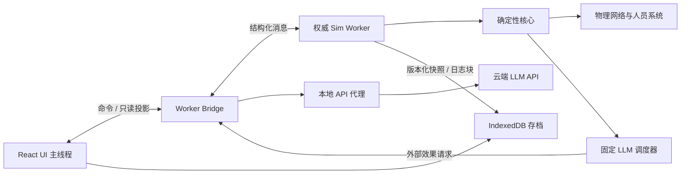

# 《远航》本地 TypeScript 引擎架构

> 文档状态：目标架构 v1.2（已同步运行时快照 v15 / 本地存档 v18）  
> 对应产品规格：[PRODUCT_SPEC.md](./PRODUCT_SPEC.md)  
> 目标运行方式：单机、单用户、本地 Web 应用  
> 核心原则：确定性、单一真值源、物理因果优先、轻依赖、可逐步替换  
> 重要声明：当前仓库已有可运行、可测试的工程因果纵切，但仍是“纵切引擎”，不是完整飞船引擎。

## 1. 本文解决什么问题

本文把产品规格落实为一套可分阶段交付的 TypeScript 架构，重点回答：

- 仿真如何在浏览器中稳定运行而不阻塞游戏界面；
- 不同时间尺度的系统如何以确定顺序推进；
- LLM、玩家、设备和物理系统如何通过命令与事件连接；
- 电力、热、气体、液体、结构和人员如何共享守恒账本；
- `2,120` 名人员如何持续存在而不造成不必要的计算负担；
- 固定多 LLM 如何等待云 API、持续重试并正确暂停模拟时间；
- 如何保存、迁移和恢复一个可确定性继续的世界；
- 上帝模式如何越过物理规则，但不破坏数据完整性和审计；
- 如何判断当前仍是系统纵切，何时才可以称为完整引擎。

## 2. 当前仓库的真实状态

以下结论以本文编写时的仓库内容为准。

### 2.1 已实现的可运行纵切

| 区域 | 当前实现 | 已验证能力 |
|---|---|---|
| 游戏界面 | `app/mission-control.tsx` | 起点、终点与最高指令；航程、舰体、乘员、AI、上帝模式五个主视图；暂停、倍率、手动存取、最多 `500` 条的全舰事件时间线与抵达报告 |
| Worker 运行时 | `lib/sim/worker.ts`、`lib/sim/protocol.ts` | Worker 是物理世界单一写入者；支持初始化、推进、干预、舰船命令、检查、快照、恢复和最终报告 |
| 确定性基础 | `lib/sim/index.ts`、`lib/sim/worker.ts` | 整数微秒时钟、种子随机流、确定性事件队列、多速率调度、状态校验和快照精确续跑；核心、人员、舱室、冷却、电力、导航、旋转、水、维修九域公共切片正常不超过 `60 s`，推进活动或旋转环失衡、故障、非 `speed-hold` 控制时不超过 `1 s`，导航活动积分内部使用 `0.1 s` 子步 |
| 聚合系统 | `lib/sim/index.ts` | 环境、休眠、跃迁充能和航程的降阶更新；电力、大气、热与水使用 `external-network`，正式 Worker 的人口使用 `external-roster`，只接收对应物理域或个体名册的权威投影 |
| 48 舱大气网络 | `lib/sim/compartments.ts` | 固定压力区、舱门/风管/隔离阀、双向流动、代谢、破口外排、显式外部汇和自适应精度；气体组分守恒 |
| A/B 水回收网络 | `lib/sim/water.ts`、`lib/sim/worker.ts` | 双环净水/废水/储备冰/浓盐水库存，两台馈线耦合的主处理与浓盐水二级回收机，生活用水和呼吸跨域质量账、延迟仪表、设备指令/故障及严格快照恢复 |
| 冷却热网 | `lib/sim/cooling.ts`、`lib/sim/worker.ts` | 双冷却回路、热节点、泵、换热器和散热器；推进、旋转驱动、跃迁、电气损耗、代谢、舰务负载与干预分源入账，已服务负载按 ID 动态产生废热；舱室热泵按 `Qhot = Qcold + W` 闭合 |
| 电力网络 | `lib/sim/electrical.ts`、`lib/sim/worker.ts` | `6` 个聚变模块、A/B 母线、断路器、分级负载和双电池；反应堆爬坡、母线孤岛、切负载、充放电效率及能量闭合；A/B 各 `60 MW` 推进控制负载约束火炬列车点火，两路 `7.5 MW` 居住环驱动负载向旋转求解器交付实际服务能量 |
| 六自由度导航 | `lib/sim/navigation.ts` | 刚体平动/转动、姿态四元数、质量与惯性、`18` 个有安装点的聚变火炬推进器；推进剂与基线 `24 t` 聚变燃料双库存，源能/理想喷流/留舰热/直排能和线/角动量账本；接收旋转环内部反作用角冲量并在转动方程中计入环转子角动量，跃迁后本地惯性帧 epoch 重基准 |
| 双反向旋转居住环 | `lib/sim/rotation.ts`、`lib/sim/worker.ts` | 固定 A/B 两环、相对舰体角速度、真实电机/轴承/制动、`speed-hold`/`coast`/`brake`、人工重力、振动、离心载荷、科里奥利系数、疲劳与轴承磨损；电能、机械能、耗散热及对舰体的等大反向角冲量显式闭合 |
| 维修与有限备件 | `lib/sim/maintenance.ts`、`lib/sim/worker.ts` | 固定 `8` 个可维护资产、A/B 各 `2` 台维修机器人和四类有限备件；任务创建即消耗匹配备件并占用同环机器人与一名清醒、技能匹配的真实船员，工时由熟练度和 `habitat-a/b` 工业馈线实际服务共同决定；完成后才调用所属物理域检修接口 |
| 传感器投影 | 六个权威物理域、`lib/sim/worker.ts` | 大气、热、电力、导航和旋转通过带采样周期、延迟、噪声及故障状态的传感器进入普通 UI 与角色观察；水域使用持久化 `5 s` 延迟的 A/B 罐量/吞吐仪表帧；上帝调试真值单独投影 |
| 人员与休眠 | `lib/sim/passengers.ts`、`lib/sim/worker.ts` | 固定 `2,000` 名乘客和 `120` 名船员；稳定身份、固定舱位、技能、健康、心理、关系、记忆与体验；固定 `32` 名关键人员；48 区压力/氧分压/二氧化碳分压/温度按五类两级风险只作用于该区清醒个体；有耗时的休眠/唤醒状态转换，A/B 各 `15 min` 本地供电储备及储备耗尽后的累计暴露健康后果；旋转环重力/振动跨阈值只作用到对应环清醒个体 |
| 人口耦合 | `lib/sim/worker.ts` | 正式 Worker 固定 `populationAuthority: external-roster`；个体清醒、休眠、死亡合计及所有生者 `health.physical`/`psychology.stability` 均值是聚合人口计数、健康与士气的唯一权威，并与休眠舱占用和 48 舱清醒占员对账；恢复时拒绝任何不一致 |
| 跃迁与航程 | `lib/sim/index.ts`、`lib/sim/worker.ts`、`lib/sim/navigation.ts` | 单次 `0.1–5 ly`、储能、热、电气和刚体联锁，非线性能耗、废热沉积、里程推进、抵达判定和最终乘客评价；最终固定选择 `6` 名确定性分层代表，覆盖船员/乘客、体验高低端和重大事故；成功后建立新导航 frame epoch 并隔离旧帧延迟样本 |
| 舰船命令 | `lib/sim/command-bus.ts`、`lib/sim/protocol.ts`、`lib/sim/worker.ts`、`app/mission-control.tsx` | 固定 actor/权限、幂等键、发行时刻、期望 revision、审计和跨九领域失败回滚；跃迁、休眠、隔离、推进、电力、冷却、空气处理、水回收、居住环控制与维修排程命令进入真实执行器；舰长每轮最多 `8` 条世界工具，按模型顺序串行执行并形成结构化设备回执 |
| 上帝干预 | `lib/sim/index.ts`、`lib/sim/worker.ts` | UI 请求进入 Worker；标量覆写原子校验并记录成功/拒绝与外部守恒声明；破口、泵故障、聚变堆跳闸、居住环轴承劣化和外部动量注入作用于对应权威物理域 |
| 自适应倍率 | `lib/sim/worker.ts` | 稳态大气使用守恒快速路径；存在破口、连接异常或传感器故障时使用细步求解，并把有效倍率限制在物理预算内 |
| 完整本地存档 | `app/mission-control.tsx`、`lib/sim/worker.ts`、`lib/llm/key-passenger-polling.ts` | 本地存档封装 `v18` 内含运行时快照 `v15` 和关键乘客轮询快照 `v2`；保存屏障先暂停新步进/调用并等待在途物理事务完成，再获取同一 Worker 安全点；权威世界恢复强制核对九域时钟、名册人口投影、空气处理捕集账、水库存/处理账、维修资源/任务账，以及电力→推进→热网、电力→环驱动、环反作用→导航和环耗散→热网账本，外层同时恢复关键乘客含舱区观测的 `published`/`pending`、调度、预算与私人 note；聚合核心/人员/舱室/冷却/电力/导航/旋转/水/维修分别为 `v6`/`v2`/`v3`/`v5`/`v4`/`v5`/`v1`/`v1`/`v1` |
| 固定 LLM 基础 | `lib/llm/index.ts`、`lib/llm/fixed-topology.ts`、`lib/llm/key-passenger-polling.ts`、`lib/sim/passengers.ts`、`config/llm.example.json` | 唯一合法拓扑为 `8` 个部门 actor 加 `32` 个名册对齐的关键乘客槽位；生产路径调用舰长、按需部门顾问和清醒且到期的关键乘客，运行时不能创建、克隆、删除或临时提升代理 |
| 云 API 网关 | `lib/llm/index.ts`、`app/api/llm` | 服务端密钥引用、自定义 JSON 请求体与 Thinking 字段、JSON/SSE/NDJSON 映射、持续重试、取消和用量；密钥端点 HTTPS/无密钥回环 HTTP 策略、URL 凭据与普通敏感头前置拒绝、每次尝试超时和响应总字节上限、三种响应的有界读取 |
| 多 LLM 舰长闭环 | `app/mission-control.tsx`、`app/api/llm`、`lib/sim/worker.ts` | 任务开始、例行周期、跃迁就绪与关键报警会触发舰长，并按事件咨询相关固定部门；关键乘客以单并发私人轮询运行；等待时暂停模拟；合法舰长工具按每轮八条上限进入串行 Worker 队列并生成回执；模型可通过一次性票据调整自身例行周期 |
| 自动化验证 | `tests/sim`、`tests/llm`、`tests/rendered-html.test.mjs` | 覆盖核心确定性、守恒、人员、六个权威物理域、九时钟 Worker 耦合、休眠供电暴露、热泵、火炬源能、旋转环动量/能量、水回收质量账、维修资源/阻塞/完成链、跨域恢复对账、命令权限/回滚、LLM 网关/路由、安全边界与生产页面 |

界面已经不再以 React 自增时间冒充仿真时间。任务开始后的时钟和主要系统读数来自 Worker；舰体区矩阵使用 48 舱传感器遥测，“乘员”卡中的区域状态和压力同样只使用其固定舱位对应的延迟传感器投影，不读取舱区真值；人工干预会改变权威状态。界面仍保留静态星图坐标与说明文案，这些不能视为动态天体求解结果；乘员卡本身则来自固定关键人员名册，不是另造的展示人口。

### 2.2 仍未实现，不能用 UI 文案代替的能力

当前仍缺少：

- 真实星表/星历、天体引力与轨道导航、移动载荷造成的质心迁移，以及恒星级坐标与局部六自由度轨迹的完整数学衔接；当前已有跃迁后的本地惯性帧 epoch 重基准，但它不是星历传播器；
- 在已经接通的电力→冷却/休眠/推进控制、逐负载废热、热泵、推进留舰热、分区急性环境后果，以及首批设备维修任务之外，仍需深化长期设备失供与连续暴露；逐段液体、结构、门禁、机器人移动路径、制造和通用备件替代网络仍未实现；
- 旋转居住环已具备降阶角动量、驱动/轴承/制动、启停、人工重力、离心载荷、科里奥利系数、疲劳与磨损；分级重力/振动阈值已接到对应环清醒乘员的个体事件，劣化轴承也可经耗时维修任务检修，但仍缺可移动配平质量、局部结构连接/裂纹、长期重力剂量和完整科里奥利行为后果；
- 火灾、烟雾、污染、裂纹、疲劳、制造、医疗资源等事故与恢复过程；
- 更多设备的状态机、维修配方与世界内命令覆盖；当前跃迁、推进控制、电网、冷却、休眠供电及首批冷却泵、空气处理、水回收、环轴承维修已有真实联锁或因果后果，命令总线也已提供权限、幂等、revision、审计和全域回滚，但尚未覆盖所有设备；
- 人员位置与可达行动、持续生理演化、资源消费到个体、工作任务、家庭/组织行为和长期社会涌现；
- 通用跨部门收件箱与跨乘客长期记忆，以及任意合法通信边上的受限嵌套讨论；当前相关部门已能按舰长关键事件参与咨询，关键乘客也已有单人只读私人轮询，但这两者都不是通用消息系统或社会自治；
- 把 LLM 外部效果请求、具名暂停令牌、观察 revision、工具幂等键和已接受响应记录全部纳入 Worker 与运行时快照；当前舰长—部门咨询、关键乘客轮询和舰长串行工具队列仍由 React 主线程协调；
- IndexedDB、自动/轮换存档、增量日志、checksum、版本迁移、导入导出和待处理 API 调用恢复；
- 真实星表/星历、多段路线规划、改道、安全港、常规推进与真实轨道/航路的衔接、全部失败结局和玩家主动终止；
- 长航程守恒漂移、全年巡航、极端事故压力、完整回放一致性、端到端玩法和系统化视觉回归验证。

当前的 LLM 闭环以舰长为决策中心，并会按事件主动调用相关部门；`32` 个不可替换的关键乘客槽位也已经进入生产轮询，但只对清醒且到期者逐人调用。运行时拓扑严格固定为 `8 + 32`，这不等于 `40` 路模型常驻并发，也不等于通用收件箱、跨乘客长期记忆、自由通信和完整社会自治已经实现。

### 2.3 当前阶段的准确称呼

当前版本可以称为：

> “已接通权威 Worker、六个权威物理域、全员名册、九时钟原子快照、跨域电热、火炬推进、反向旋转环、水回收与有限维修资源账本、通用命令总线、上帝干预，以及受固定 40 节点拓扑约束的舰长—部门闭环与关键乘客私人轮询的可运行工程因果纵切。”

它已经不是静态界面或彼此孤立的技术样例，但仍不能称为“完整飞船引擎”。只有本文第 18.7 节的完成定义全部成立后，才可以使用“完整目标引擎”这一称呼。

## 3. 总体架构

下图表示完整目标架构，而不是对当前实现位置的逐项宣称：



目标架构只有四个运行边界：

1. **React 主线程**：渲染、输入、声音、IndexedDB I/O，不拥有世界真值。
2. **Sim Worker**：唯一权威状态、时间、调度、命令、物理、人员、LLM 调度。
3. **本地 API 代理**：保护密钥，执行单次云 API 尝试并规范化流。
4. **云端模型**：不可信、非确定、可能迟到或持续失败的外部服务。

不引入微服务、消息中间件、Redux、通用 ECS、WASM、独立数据库服务或多进程仿真。只有实际性能数据证明 TypeScript Worker 无法满足预算时，才考虑局部 WASM。

当前已经存在 UI、Sim Worker、本地 API 代理和云模型四个边界；Worker 已承载确定性核心、人员、48 舱大气、冷却、电力、六自由度导航、双反向旋转环、A/B 水回收和维修任务网络，并把九个时钟作为同一事务推进。与目标图的主要差异是：舰长主决策、部门咨询、关键乘客轮询、暂停和串行工具队列目前仍由 React 协调，尚未成为 Worker 内可存档的外部效果；`v18` 外层存档已保存乘客轮询调度及脱敏舱区观测，并在手动保存时建立等待在途物理事务完成的短暂停顿屏障，但介质仍是 `localStorage`，不是 IndexedDB。

## 4. 代码组织

保留现有 Next/vinext 单体工程，不建立 monorepo。建议按以下结构逐步拆分现有两个大文件：

```text
app/
  api/
    llm/
      attempt/route.ts       # 服务端单次云 API 尝试；密钥不进浏览器
  mission-control.tsx        # 页面组合，不保存权威世界
  ui/                        # 面板、图表、选择器、音效

lib/
  sim/
    index.ts                 # 稳定公共导出，兼容现有调用
    core/
      clock.ts
      random.ts
      event-queue.ts
      scheduler.ts
      command-bus.ts
      engine.ts
    model/
      ids.ts
      state.ts
      schemas.ts
      units.ts
    systems/
      power.ts
      thermal.ts
      atmosphere.ts
      water.ts
      structure.ts
      flight.ts
      rotation.ts
      journey.ts
    networks/
      graph.ts
      electrical.ts
      fluid.ts
      thermal.ts
      structural.ts
    people/
      population.ts
      physiology.ts
      behavior.ts
      social.ts
      experience.ts
      hibernation.ts
    sensors/
      sensors.ts
      observations.ts
    interventions/
      god-mode.ts
      balance-ledger.ts
    runtime/
      protocol.ts
      sim-worker.ts
      host-bridge.ts
    persistence/
      snapshot.ts
      migrations.ts
      indexed-db.ts

  llm/
    index.ts                 # 稳定公共导出
    registry.ts
    routines.ts
    templates.ts
    response-parser.ts
    coordinator.ts
    key-passenger-polling.ts # 当前关键乘客延迟观测、预算、调度与快照
    memory.ts
    tool-router.ts
    retry.ts

  scenarios/
    baseline-ship.ts
    star-catalog.ts
    events.ts

tests/
  unit/
  property/
  integration/
  replay/
  worker/
  persistence/
  e2e/
  performance/
```

拆分应在功能接入时渐进进行，不为了目录整齐一次性重写已经通过测试的代码。`lib/sim/index.ts` 与 `lib/llm/index.ts` 在迁移期继续作为稳定入口。

## 5. 权威状态与确定性

### 5.1 单一写入者

只有 Sim Worker 可以修改世界状态。

- React 只能发送命令或上帝干预请求。
- API 代理只能返回外部结果。
- LLM 输出首先是数据，必须经过工具解析、权限校验和命令总线。
- 存档层只能保存或恢复由 Worker 生成的快照。
- UI 卡片和图表只消费只读投影，不维护另一份“看起来像世界”的状态。

React 可以独立保存导航页签、窗口大小、筛选器和音量等纯 UI 状态，这些不得反向覆盖仿真真值。

### 5.2 确定性的定义

引擎保证：

`相同引擎版本 + 相同快照 + 相同有序外部输入 -> 相同后续状态与事件`

外部输入包括：

- 玩家命令和上帝干预；
- 已接受的 LLM 响应；
- 来自真实墙钟的非仿真元数据。

“相同种子”不足以保证含云端 LLM 的整段航程相同，因为模型响应不确定。引擎必须把被接受的 LLM 响应记录为外部输入，才能重放已发生部分。

### 5.3 核心禁用项

确定性核心中禁止：

- `Date.now()` 和系统时区；
- `Math.random()`；
- DOM、React、网络和 IndexedDB；
- 未排序的外部集合遍历；
- 依赖对象地址或执行时机的 ID；
- 在异步回调中直接修改世界。

核心时间使用整数微秒。JavaScript `number` 的安全整数范围足以覆盖约 285 年的微秒时间；超过范围前必须迁移时间表示。浮点物理保证同一受支持 JavaScript 引擎与同一版本内确定，不宣称跨所有硬件实现位级一致。关键守恒量在系统边界量化并校验容差。

### 5.4 状态表示

不引入通用 ECS。使用规范化、按领域分组的类型化记录：

- 实体由稳定字符串或整数 ID 标识；
- 热路径优先用紧凑数组或 TypedArray；
- 关系用稀疏边表；
- Map/Set 在快照中转为按 ID 排序的数组；
- 所有可变状态都必须进入快照；
- 派生值不重复持久化，除非重算成本过高或会影响确定性。

正式 Worker 以 `SimulationEngine({ populationAuthority: "external-roster" })` 建立聚合核心。`2,120` 人名册是人口领域的单一权威：计数来自每个个体的生命状态，健康和士气分别是所有生者 `health.physical` 与 `psychology.stability` 的算术均值；聚合核心自身不再运行另一套会让这两个均值漂移的人口方程。每次人员事件后 Worker 把名册投影回聚合状态，恢复时则反向核对计数、均值、休眠舱占用与分区清醒占员，任何差异都会拒绝整个恢复事务。

## 6. 确定性多速率仿真

### 6.1 不依赖动画帧

主线程的 `requestAnimationFrame` 只负责显示。Worker 根据目标模拟时间推进，不以“每一帧调用一次物理”作为权威时间源。

推进循环：

1. 计算下一个系统边界、计划事件、命令生效点或 LLM 唤醒点；
2. 选择其中最早的模拟时间；
3. 将时钟推进到该边界；
4. 按固定阶段和优先级处理；
5. 校验不变量与守恒；
6. 必要时生成 UI 投影或存档安全点；
7. 重复直到达到本次时间预算、目标时间或暂停屏障。

### 6.2 同一时间点的固定阶段

事件排序键统一为：

`(simTimeUs, phase, priorityDescending, sequenceAscending)`

阶段固定为：

| Phase | 内容 |
|---:|---|
| 0 | 已接受的外部结果、上帝干预、玩家控制命令 |
| 10 | 拓扑变化：断路器、阀门、门、裂口、连接失效 |
| 20 | 确定性控制器和安全联锁 |
| 30 | 电力、流体、热、结构、飞行动力学与旋转环耦合 |
| 40 | 生命保障、资源和设备老化 |
| 50 | 人员生理、休眠、行动和社会 |
| 60 | 传感器采样、噪声、报警和角色观察 |
| 70 | LLM/人员唤醒判定、任务终止判定 |
| 80 | 守恒审计、只读投影和存档安全点 |

同一事件不得在处理过程中插队到已经完成的阶段。若产生更早阶段的后续工作，将其安排到下一合法微时间点或显式子迭代。

### 6.3 推荐系统周期

周期是初始值，不是硬编码业务规则：

当前 Worker 已经把核心、人员、舱室、冷却、电力、导航、旋转和水回收八个权威域放在统一公共时钟切片中：正常航行的公共片最长 `60 s`；只要推进器正在工作，或两环净相对角动量超过细耦合阈值、环驱动/轴承故障、馈线不可用、偏离目标或采用非 `speed-hold` 模式，公共片最长 `1 s`，下一推进命令边界更近时还会提前切开；导航求解器在活动推进片内继续以 `100 ms` 子步积分。这里的 `60 s / 1 s` 是跨域提交边界，`100 ms` 是导航内部数值步长，两者不能混为一个“全船 tick”。

| 系统 | 正常周期 | 事故时最细周期 |
|---|---:|---:|
| 姿态、推进和安全控制 | `100 ms–1 s` | `20–100 ms` |
| 旋转环驱动、轴承和舰体耦合 | 稳态公共片最长 `60 s` | 失衡/故障/非保持时 `1 s` |
| 电网保护与功率平衡 | `1 s` | `100 ms` |
| 舱压与高速泄漏 | `5 s` | `100 ms–1 s` |
| 热与冷却网络 | `2–10 s` | `500 ms–2 s` |
| 水、空气处理和库存 | `1 min` | `5–10 s` |
| 设备磨损与维护 | `10 min–1 h` | 事件触发 |
| 清醒人员生理 | `1 min` | `1–5 s` |
| 普通乘客行为 | `5–30 min` | `10–60 s` |
| 休眠人员稳定状态 | `1 h` | `1–10 min` |
| 社会关系与体验汇总 | `1 h` | 事件触发 |

系统可以降低周期，但不得跨越自身声明的稳定性上限。高速推进时优先使用解析积分、事件跳跃和稳定区间合并，而不是简单把 `dt` 无限放大。

### 6.4 数值策略

- 刚体平动与转动采用半隐式积分，姿态使用归一化四元数。
- 电力分配采用确定性的优先级和网络约束求解。
- 热网络优先使用能量守恒的节点热容/边导热模型。
- 舱室和液体网络以节点库存、边流量进行零和转移。
- 强耦合网络使用固定次数、固定顺序的子迭代，禁止以墙钟决定收敛次数。
- 每次转移先计算通量，再统一提交，避免遍历顺序改变结果。
- 所有库存设物理下界；发生不足时按确定性规则限流，而不是事后截断并丢失差额。
- 每个系统声明质量、能量和动量的输入、输出与容差。

## 7. Web Worker 运行时

### 7.1 为什么必须使用 Worker

物理、乘客和事件循环不能运行在 React 主线程。否则高倍率推进、快照序列化或事故子迭代会造成界面卡顿，并使仿真进度依赖浏览器渲染负载。

Worker 是权威状态容器，也形成明确的安全边界：普通 UI 交互不能直接拿到并修改可变世界对象。

### 7.2 消息协议

主线程到 Worker：

```ts
type HostToWorker =
  | { type: "initialize"; scenario: ScenarioDefinition }
  | { type: "advance"; wallBudgetMs: number }
  | { type: "set-time-scale"; scale: number }
  | { type: "pause"; token: string; reason: string }
  | { type: "resume"; token: string }
  | { type: "submit-command"; command: CommandEnvelope }
  | { type: "god-intervention"; request: GodIntervention }
  | { type: "external-result"; result: ExternalEffectResult }
  | { type: "request-projection"; query: ProjectionQuery }
  | { type: "request-snapshot"; requestId: string }
  | { type: "restore"; save: SaveEnvelope };
```

Worker 到主线程：

```ts
type WorkerToHost =
  | { type: "ready"; engineVersion: string }
  | { type: "projection"; revision: number; patch: ProjectionPatch }
  | { type: "alert"; event: ObserverEvent }
  | { type: "pause-changed"; state: PauseState }
  | { type: "external-effect"; request: ExternalEffectRequest }
  | { type: "snapshot-ready"; requestId: string; save: SaveEnvelope }
  | { type: "fatal"; error: SerializableError };
```

所有消息必须通过运行时 schema 校验。协议包含独立版本号，避免新 UI 误连旧 Worker。

### 7.3 UI 投影

Worker 不应每帧复制完整世界：

- 常用总览以 `5–10 Hz` 发送差量投影；
- 图表以降采样时间序列发送；
- 舱室、乘客和设备详情按选择查询；
- 大型数值序列使用 Transferable TypedArray；
- 日志分页或游标读取；
- UI 永远不能从投影还原出可写世界引用。

### 7.4 Worker 生命周期

- 页面载入后先启动 Worker，再加载或创建世界。
- 页面后台时仿真是否继续由用户设置决定；不得偷偷用墙钟补算。
- Worker 崩溃时停止接受命令，保留最近一次成功自动存档并显示错误。
- 热更新只用于开发；正式航程不允许在不同引擎版本间无迁移地继续内存状态。

## 8. 命令、事件与执行过程

### 8.1 四种不同概念

| 类型 | 含义 | 是否能直接改世界 |
|---|---|---|
| Command | 某个角色请求世界采取动作 | 否 |
| Domain Event | 已经发生的事实 | 否，仅记录事实 |
| Scheduled Event | 未来某时刻要处理的确定性触发器 | 到时由系统处理 |
| God Intervention | 世界外原子注入或因果事件 | 可以，受数据完整性校验 |

不能把 LLM 的“关闭阀门”文字直接记录为阀门已关闭。

### 8.2 命令信封

每条命令至少包含：

```ts
interface CommandEnvelope<T = unknown> {
  commandId: string;
  idempotencyKey: string;
  actorId: string;
  issuedAtSimUs: number;
  expectedRevision?: number;
  type: string;
  payload: T;
  correlationId: string;
  causationId?: string;
}
```

处理顺序：

1. schema 校验；
2. 身份与权限；
3. 目标存在性和可见性；
4. 当前状态与 `expectedRevision`；
5. 安全联锁和覆盖授权；
6. 创建有时长的设备/人员行动；
7. 行动推进后产生完成或失败事件；
8. 传感器在之后的采样阶段反映结果。

设备命令统一经历：

`requested -> accepted/rejected -> executing -> completed/failed/cancelled`

当前 `DeterministicCommandBus` 已落地固定拓扑、角色白名单、幂等指纹、命令 revision、审计历史和执行器错误回滚。Worker 还会在进入总线前核对 `issuedAtMicroseconds` 与聚合世界 `expectedStateRevision`；任何一域执行失败都会恢复核心、人员、舱室、冷却、电力、导航、旋转、水和维修的事务前快照。

当前世界内权限如下；上帝干预不属于这张表，也不能由 LLM 命令伪装：

| 固定 actor / 角色 | 当前允许的命令 |
|---|---|
| `captain` | 全部下列世界内命令 |
| `navigation` | `execute-jump`、`schedule-thruster-pulse`、`schedule-thruster-maneuver` |
| `engineering` | `set-reactor-target`、`set-reactor-mode`、`set-cooling-pump-speed`、`set-electrical-load-enabled`、`set-electrical-breaker`、`set-battery-mode`、`set-habitat-ring-control`、`set-air-handler-control`、`set-water-processor-control`、`schedule-maintenance` |
| `medical` | `set-awake-target` |
| `life-support` | `isolate-pressure-zone`、`set-air-handler-control`、`set-water-processor-control` |
| `security` | `isolate-pressure-zone` |
| `passenger-affairs`、`passenger-service` | 暂无物理命令白名单，只承担观察/沟通职责 |

### 8.3 工具路由

LLM 工具定义不暴露任意路径写入。当前舰长工具按领域映射到明确命令：

- 航程/人员：`execute_jump`、`set_awake_target`、`isolate_pressure_zone`；
- 导航：`schedule_thruster_pulse`、`schedule_thruster_maneuver`；
- 工程：`set_reactor_target`、`set_reactor_mode`、`set_cooling_pump_speed`、`set_electrical_load_enabled`、`set_electrical_breaker`、`set_battery_mode`、`set_habitat_ring_control`、`set_air_handler_control`、`set_water_processor_control`、`schedule_maintenance`。居住环工具只能选择固定 A/B 环并命令 `speed-hold`、`coast` 或 `brake` 及目标相对转速；实际 RPM 和人工重力仍由供电、扭矩、轴承、制动和舰体反作用求解。维修工具只接受固定资产 ID，并创建耗时、耗备件、占用人员与机器人的任务，不能直接改变设备工况。

工具参数先按 JSON Schema 校验，再生成带稳定 `commandId` / `idempotencyKey` 的 Worker 命令。相同 `callId + toolCallId` 只能产生一次世界动作；网络重试不得重复执行。`configure_self_routine` 是服务端签发一次性票据的 LLM 自管理能力，不是改写物理世界的命令。

当前舰长一轮响应只接受前 `8` 条世界工具。合法工具按模型返回顺序进入单一串行队列，上一条取得 Worker 结果后才提交下一条；解析失败、设备拒绝、执行成功、队列上限和后续跳过都会形成结构化回执，至少保留序号、`toolCallId`、工具名、命令类型、状态与摘要。回执进入下一轮舰长观察，模型不能把“已调用工具”当作“设备已经完成”；串行队列也避免同一轮多条命令在未知中间状态上并发竞争。

### 8.4 事件日志

领域事件使用单调递增序号，包含模拟时间、因果 ID、相关实体和最小必要载荷。事件日志用于：

- UI 时间线；
- 乘客经历和 AI 观察；
- 调试因果链；
- 增量存档；
- 已发生航段的确定性重放。

事件日志不是唯一状态存储。长航程以周期快照加分块日志恢复，避免从起航事件重放数月。

## 9. 物理网络

### 9.1 统一图模型

电力、气体、液体、热和结构使用各自求解器，但共享稳定 ID、显式拓扑和版本化状态的设计。当前已落地的舱室、冷却和电力域各自保留适合本领域的类型化节点/连接记录，没有为了形式统一而引入通用 ECS：

```ts
interface NetworkNode<TState> {
  id: string;
  kind: string;
  state: TState;
}

interface NetworkEdge<TState> {
  id: string;
  from: string;
  to: string;
  kind: string;
  enabled: boolean;
  state: TState;
}
```

图拓扑只在门、阀、断路器、裂口、断线或结构连接变化时重建。普通每步只更新节点和边状态。

### 9.2 电力网络

节点类型包括发电机、母线、储能、负载和接地点；边包括电缆、断路器、变换器和限流器。

当前权威电力网络已经覆盖：

- `6` 个聚变模块的模式、故障、目标功率和爬坡率；
- A/B 母线、机组/储能/负载断路器与母联孤岛；
- 双电池的容量、功率、控制模式、充放电效率、损耗和故障；
- 三级负载的确定性分配、切除与未服务功率，其中 A/B 两路推进控制列车各有 `60 MW` 固定额定负载，A/B 两路居住环驱动各有 `7.5 MW` 额定负载；
- 电压、频率、反应堆输出和电池状态的延迟/噪声/故障传感器；
- 发电、逐负载需求/服务、储能和转换损耗的显式能量账本；
- 冷却泵、生命保障、休眠 A/B 舱群、跃迁驱动、推进控制列车和两组居住环驱动实际读取各自负载的服务能量，未供电不会被聚合平均值掩盖。

已服务负载会按负载 ID 和固定热化比例动态汇总成舰务热源，电池转换损耗另以 `electrical-loss` 分类进入热网；因此当前废热不再是与电网脱离的固定 UI 数字。它仍不模拟高频电磁暂态；未服务负载对尚未接线的设备和全部人员的完整后果、黑启动操作流程，以及把汇总舰务热进一步分配到每个局部设备节点仍需深化。

### 9.3 气体与液体网络

当前气体网络以 `48` 个压力区为节点，以门、风管、隔离连接和对太空破口为边；含氧气、氮气、二氧化碳、水蒸气、代谢与 CO₂ 捕集。当前液体纵切以 A/B 两套固定水环为节点，每环分别保存净水、废水、储备冰和浓盐水库存，并由同环水回收机处理；它已替代聚合核心里原先每分钟直接改总量的第二套水方程，但尚未展开到逐段管路压降、阀门、泵和过滤床寿命。

空气处理不是聚合大气上的“删除 CO₂”函数。固定 `air-handler-a` 与 `air-handler-b` 各服务本环 `24` 区并分别读取 `life-support-a`、`life-support-b` 的区间服务能量。实际风量比例为风量指令、设备工况倍率与本侧电力服务比例的乘积；它缩放所属环路风管的强制对流混合，但不改变门、阀和破口由压差产生的被动质量流。每台吸附器额定捕集能力为 `0.09 kg/s`，只按各区高于固定 `80 Pa` 控制设定点的可移除 CO₂ 质量比例抽取，既不会跨环吸取，也不会把舱内 CO₂ 追到绝对零。捕获质量与泄漏汇一样进入物种守恒账，并以逐机累计量持久化；恢复时还要与聚合引擎的累计捕集投影交叉核对。

普通舰体 UI 和 LLM 只获得控制器指令记录以及延迟、带噪的分环/分区压力与 CO₂ 传感结果；设备 `condition`、实际风量和捕集账只在权威快照及上帝真值面板出现。舰长、工程和生命保障可以发出风量/吸附器命令，但不能直接指定 CO₂ 分压。上帝模式的处理机跳停也只把设备置为 `stuck-off`，后续积累和混合仍由求解器产生。

水回收机的固定额定输入各为 `3,000 kg/day`。每公斤废水先经 `85%` 主处理，剩余浓盐水再回收其中 `87%`，组合回收率为 `98.05%`；残余质量进入浓盐水库存，绝不会凭空消失。真实吞吐为额定值乘处理量指令、电力服务比例和设备工况倍率，并继续受本环废水库存与净水罐余量限制。生活用水从净水转移到废水；舱室代谢产生的水蒸气则先从对应 A/B 净水库存显式扣除，再跨域进入舱气，因此全船封闭质量仍闭合。湿度冷凝回流接口已经进入水域账本，但舱气冷凝器尚未接线，不能把尚未回收的舱内水蒸气提前算作净水。

水域保存 `initial + condensate + external - metabolic = current inventory` 质量账，以及生活转移、处理输入、主回收、浓盐水回收和残余浓盐水累计量。普通舰体 UI 和 LLM 只看到持久化、固定延迟 `5 s` 的 A/B 罐量/吞吐仪表帧和控制器指令；设备工况、即时吞吐和完整质量账只在权威快照及上帝真值面板出现。舰长、工程和生命保障可发出处理量命令，但不能直接生成净水；上帝模式可跳停实体回收机，也可通过带外部质量声明的 Force 改写总净水库存。

每步：

1. 从旧状态计算边流量；
2. 按库存和边容量限流；
3. 对节点执行零和质量转移；
4. 加入明确的外部源汇；
5. 更新压力、温度和组分；
6. 记录泄漏到太空或处理产物。

### 9.4 热网络

当前权威冷却热网已经为每个热节点记录热容、温度和能量，为双冷却回路记录泵、换热器和散热器状态。泵的指令转速经真实泵体条件和电力服务比例影响流量，冷却剂搬运能量，散热器按温度和有效面积向外部环境辐射；热传感器同样具有延迟、噪声、退化、卡死和离线状态。

外部热量按 `propulsion`、`rotation-drive`、`jump-drive`、`electrical-loss`、`metabolic`、`ship-services` 和 `intervention` 分类累计，并与热网总外部能量闭合。乘员显热不是从舱室凭空消失：舱室热泵受生命保障服务能量、冷却流量和温差 COP 约束，从舱室移走 `Qcold`，消耗压缩机功 `W`，再把 `Qhot = Qcold + W` 注入热母线。火炬转换留舰热与已服务推进控制能进入 `propulsion` 分类；居住环控制电耗、电机损耗、轴承摩擦和制动耗散进入 `rotation-drive` 分类，不再由通用负载热化重复计算。

严禁把“散热余量”作为独立可写百分比。它必须由温度、流量、散热面积、姿态和设备状态派生。

当前仍需把汇总舰务热细分到更多局部设备/舱段节点，并接入更完整的舱壁热交换和导航姿态对散热器视因子；电池转换损耗、逐负载动态废热、代谢热泵和推进留舰热已经进入权威网络，不能再列作“完全尚未接入”。

### 9.5 结构、飞行与旋转居住环

当前 `RigidBodyNavigation` 已实现局部惯性系中的降阶六自由度模型：

- 船体干质量与推进剂质量共同决定质量和对角惯性张量；
- `18` 个聚变火炬推进器按各自安装点、方向、推力、比冲和节流产生力、力矩与推进剂消耗；
- 基线除 `36,000 t` 推进剂外另有 `24 t` 聚变燃料；可用推力同时受两类库存约束，任一耗尽都会一致截断燃烧；
- 火炬把聚变源能显式闭合为理想喷流能、留舰转换热和直排能，并另审计实际排气动能与船体机械能；
- A/B 推进控制列车分别读取电网中各 `60 MW` 控制负载的服务能量；未供电列车不能点火，卡在开启状态的故障仍按其物理状态产生因果后果；
- 半隐式推进平动与转动，姿态使用归一化四元数；
- 单脉冲和多脉冲机动按模拟时间排程，非法多脉冲事务不会留下部分排程；
- 外部线冲量和角动量变化进入实际刚体状态并记入上帝守恒审计；
- 位置、速度、姿态、角速度、推进剂和聚变燃料均先经导航传感器再进入普通观察；
- 成功跃迁后 `frameEpoch` 增加，本地位置归零、动量/机械能账本以保留的速度和姿态重新设基线，旧 epoch 的延迟传感器队列被清空，不产生虚构冲量或库存变化。

当前 `CounterRotatingHabitat` 是旋转权威物理域，并遵循以下耦合约定：

- 拓扑固定为 A/B 两环，运行时不能创建、删除或替换；每环基线半径 `224 m`、质量 `18,000,000 kg`，以薄环转动惯量建模，初始相对转速分别约为 `+2 rpm` 与 `-2 rpm`；
- 环状态保存相对舰体的角速度。导航的整船 `I_total` 已包含两环作为随舰体共转质量，不能再把环绝对转动惯量重复加一次；总角动量采用 `H = I_total Ω + Σ I_i ω_i`，耦合动能采用 `K = 1/2 I_total Ω² + Ω Σ I_i ω_i + 1/2 Σ I_i ω_i²`；
- 人工重力由 `a = R (Ω_x + ω_i)²` 派生，不存在可写的“重力百分比”；结构离心载荷、轴承径向载荷、科里奥利系数、振动、疲劳比例和轴承磨损均从物理状态演化；
- `speed-hold` 通过有限扭矩、效率和实际服务电能逼近目标相对转速，`coast` 只受被动轴承摩擦，`brake` 通过真实制动扭矩耗散机械能；驱动失供、轴承劣化或卡死不会被控制目标覆盖；
- 每次环角动量变化都会向导航提交等大反向舰体角冲量；导航转动方程还把净环转子角动量放入陀螺项，因此不平衡两环会与六自由度舰体姿态真实耦合；
- 服务电能闭合为耦合机械能变化与控制/电机/轴承/制动热，耗散热以 `rotation-drive` 分类进入热网；正常相消、失衡、制动和断电过程都不能靠直接覆写 RPM 完成；
- 普通 UI 与 LLM 只能获得延迟、带噪且可能退化、卡死或离线的相对 RPM、人工重力和振动；净环角动量、能量闭合误差、疲劳、磨损和设备真值只属于权威状态与上帝调试观察。

当前旋转域是工程降阶模型，不是完整结构求解器。环重力/振动阈值已经产生分环个体后果，劣化/故障轴承也可通过维修任务完成检修并保留少量历史磨损；但天体引力、轨道求解、恒星级坐标到局部 frame epoch 的真实坐标变换、部件移动导致的质心变化、可移动配平质量、结构连接图、局部裂纹传播、长期重力剂量和人员在科里奥利环境中的完整行为后果仍是目标；不计划做全船实时有限元。

跃迁是显式的虚构物理模块：它只有在储能、A/B 跃迁负载服务、热母线温度、刚体角速度和设备状态全部通过联锁后才产生离散空间变换，并记录能量消耗、废热、磨损和误差。跃迁后的 epoch 重基准保持速度、姿态、角速度、质量和库存连续；这解决了局部帧生命周期，却没有冒充真实星历或轨道跳转。

### 9.6 维修任务、机器人与有限备件

当前 `MaintenanceNetwork` 是第九个原子恢复域，不是界面上的“修复进度条”。固定拓扑包含 A/B 冷却泵、空气处理机、水回收机和居住环轴承共 `8` 个资产、A/B 各 `2` 台维修机器人，以及泵检修包、空气处理滤芯、水处理膜组件、轴承检修包四类有限库存。普通 UI、舰长和工程部门只看到每 `60 s` 采样、延迟 `120 s` 发布的设备诊断；上帝页才显示即时设备真值和完整资源账。

`schedule-maintenance` 的因果顺序固定为：

1. 命令总线验证 actor、资产 ID、幂等键、世界 revision，并确认权威设备确实处于可维修的非正常状态；
2. 从真实清醒名册中按资产所需技能与熟练度稳定选择船员；同一资产不能存在两个活动任务；
3. 任务创建时立即消耗一件固定配方备件，并占用目标同环的一台空闲机器人；无备件、无机器人或无合格清醒船员都会拒绝，而不是免费排队；
4. 每个公共切片只按 `delta × (0.5 + 0.5 × 熟练度) × 工业馈线服务比例` 累计工时；分配船员进入休眠时标记 `crew-unavailable`，本环 `habitat-a/b` 负载完全失供时标记 `workshop-unpowered`；
5. 工时完成后释放机器人，再由 Worker 调用设备所属物理域的检修接口；冷却泵、空气处理机和水回收机恢复正常工况，环轴承恢复正常但保留最多 `0.05` 的历史磨损；备件不会退回。

快照校验会核对固定资产/机器人拓扑、任务序号、任务—机器人占用、活动资产唯一性、固定维修配方、工时范围，以及 `初始库存 - 历史任务数 = 当前库存`。当前模型仍没有机器人路径、门禁可达性、电池电量、维修伤害、部件拆装图、现场制造、通用备件替代或结构破口封堵任务；这些不能由首批设备维修纵切代替。

### 9.7 守恒账本

每个求解阶段返回：

```ts
interface BalanceDelta {
  massKg: number;
  energyJ: number;
  linearMomentum: Vec3;
  angularMomentum: Vec3;
  sources: BalanceEntry[];
  sinks: BalanceEntry[];
}
```

内部转移总和应为零；代谢、核反应、辐射散热、排气和泄漏作为有解释的跨域转换或外部源汇。当前恢复流程会交叉核对：电网累计请求/服务的推进控制能、导航推进账本中的控制能和冷却 `propulsion` 留舰热；电网向 A/B 环驱动请求/交付的能量与旋转能账；旋转域交付舰体的角冲量/机械能与导航内部交换账；旋转耗散热与冷却 `rotation-drive` 分类。这样可防止分别合法的子快照组合成跨域不闭合状态。每个大步完成后执行容差审计。超过容差：

- 开发模式立即抛错并保留快照；
- 正式模式暂停仿真、显示引擎故障，不静默修正。

## 10. 乘客与社会仿真

### 10.1 数据规模

`2,120` 人全部是持久个体，但不要求每人每秒运行复杂行为树。

核心数据分层：

- **静态档案**：身份、家庭、技能、基础人格；
- **热状态**：位置、姿态、健康、压力、当前行动；
- **稀疏关系**：亲属、朋友、工作、冲突；
- **事件印象**：本人实际经历和获知事件；
- **计划状态**：下一行动与下次更新时间。

热状态使用紧凑数组；详细文本和历史按 ID 分块。UI 只查询当前可见的少量乘客。

### 10.2 更新分层

| 人群 | 正常更新 | 提升条件 |
|---|---|---|
| 休眠且稳定 | 每仿真小时 | 舱故障、医疗异常、计划唤醒 |
| 清醒且远离事件 | 每 `5–30` 分钟 | 收到消息、需求超阈值 |
| 工作/移动中 | 每 `10–60` 秒 | 通道变化、设备操作 |
| 伤员或事故现场 | 每 `1–5` 秒 | 直到稳定或离场 |
| 固定关键乘客 LLM | 当前默认每人 `12 h`，有效下限 `6 h`；只轮询清醒者 | 本人延迟分档观测到期，且满足全局预算与节流 |

更新频率变化不得删除个体状态。生理暴露在休眠区间内使用解析累计或分段积分。

### 10.3 生理与资源耦合

清醒人员消耗氧气、饮水和食物，产生二氧化碳、水、废物和热。实际消耗受体型、活动、健康和环境影响。

环境伤害来自个人所在舱室的真实状态，而不是全船平均值。伤害、疾病、药物和治疗产生有时长的状态变化。死亡是不可逆领域事件，并更新家庭、岗位和社会关系。

当前已落地的舱区—人员纵切读取 48 区权威真值中的总压、氧分压、二氧化碳分压和温度，并分成五类、每类两级急性危险：

| 危险族 | 一级进入条件 | 二级进入条件 |
|---|---:|---:|
| 低压 | `< 75 kPa` | `< 50 kPa` |
| 低氧 | 氧分压 `< 18 kPa` | 氧分压 `< 14 kPa` |
| 高二氧化碳 | 二氧化碳分压 `> 1.5 kPa` | 二氧化碳分压 `> 3 kPa` |
| 寒冷 | `< 283.15 K` | `< 273.15 K` |
| 高温 | `> 303.15 K` | `> 313.15 K` |

后果只写入固定 `cabinId → zoneId` 映射落在该区、当时处于 `awake` 的具体人员，改变其健康、心理、体验和带事故引用的个人记忆；不会用全船平均环境给全员扣分。每个 `zoneId × hazard family` 都把 `currentTier` 与单调递增的 `episode` 存入运行时快照：从安全带进入危险带开启新 episode，一级升二级只补记新达到的层级，同一 episode 同一层级由稳定事件 ID 保证幂等，完全退出后再次进入才建立下一 episode。

这条纵切是“进入/升级阈值时的一次性急性后果”，不是按暴露秒数连续积分的长期剂量模型，也不是人员移动、避险路径或治疗过程模型。休眠者由休眠舱及其 A/B 供电储备链保护，不按固定 cabin 接受上述清醒舱区暴露；目前也不能把固定舱位误读为实时人员位置。

### 10.4 行动与可达性

人员和机器人行动必须：

- 选择真实路径；
- 通过门禁和舱门；
- 消耗时间、电量或体力；
- 受失压、火灾、人工重力和通道阻塞影响；
- 竞争有限工具、医疗位、运输和设备访问权。

首版可使用舱段级路径图，不模拟逐厘米寻路。

### 10.5 社会与体验

社会模型采用事件驱动的需求、信任和关系变化，不让每对乘客形成稠密矩阵。每人只保存实际关系边和有限数量的重要事件印象。

乘客评价在航程中增量积累：

- 安全、舒适、健康、自由、隐私、公平、透明；
- 对舰长、部门、家庭和群体的信任；
- 亲历与传闻分开；
- 对强制、欺骗、牺牲和资源分配保留事件引用。

结束时从这些经历生成个人叙述和群体分歧，不临时让模型凭空总结未被保存的全局真值。当前最终报告确定性选择 `6` 名互不重复的分层代表：优先纳入最重要事故记忆者，并锚定船员与乘客各自的低体验端和高体验端，剩余名额再按稳定的体验极值交错规则补齐；因此代表不局限于 `32` 名关键 LLM，也不会因为数组顺序随机漂移。

当前旋转—人员纵切以真实环状态检测阈值跨越：A/B 环分别定位当时清醒人员，低重力、高重力和结构振动只写入实际所在环个体的心理压力、稳定性、舒适、安全感及个人事件记忆；危险高重力还可产生急性健康后果。同一危险带持续存在时不会按 `1 s` 物理片重复处罚，稳定事件 ID 也避免恢复或再次进入相同带时重复记账。它是离散事故/体验纵切，不等于已经有按暴露时长积分的完整生理或科里奥利模型。

## 11. 休眠系统

### 11.1 休眠状态机

每名人员独立经历：

```text
awake
  -> assessment
  -> preparation
  -> induction
  -> cooling
  -> stable-hibernation
  -> rewarming
  -> recovery
  -> awake
```

任一阶段都可转入 `complication`、`emergency-wake`、`aborted` 或 `deceased`。

### 11.2 休眠舱是设备

每个休眠舱连接：

- 电力母线；
- 冷却回路；
- 气体与循环支持；
- 药物和耗材库存；
- 生理传感器；
- 本地控制器和通信；
- 可达舱室与维修路径。

休眠稳定不等于冻结人物。舱温、供电、冷却、药物、疾病和设备老化持续作用于个体。

当前纵切已把 `2,200` 个舱位按 A/B 两个供电组接入电网。每组具有独立 `15 min` 本地维持储备：馈线部分失供时按缺口比例消耗储备，供电恢复后按确定性速率回充；储备耗尽后累计未保护暴露剂量。剂量跨越分级阈值时，会对该组所有正在休眠的人员原子写入身体健康、韧性、慢性风险、心理压力、休眠体验和带事件 ID 的个人记忆，严重级别可造成不可逆后果。恢复与存档保留每组剩余储备、累计剂量、故障序号和最高已触发级别，避免读档后重复处罚。

### 11.3 休眠命令

LLM 只能提交：

- 评估候选人；
- 预约舱位；
- 安排医护与机器人；
- 启动诱导或唤醒流程；
- 调整合法设备设定；
- 发起紧急唤醒。

命令可能因舱位、药物、人员、权限、病情或设备状态被拒绝。强制休眠仍需现实执行，并产生抵抗和社会后果。

## 12. 固定多 LLM 编排

### 12.1 拓扑冻结

当前场景合同固定为：

- `captain`、`navigation`、`engineering`、`life-support`、`medical`、`passenger-affairs`、`security`、`passenger-service` 共 `8` 个部门 actor；
- 持久人员名册中恰好 `32` 个按槽位和人员 ID 固定的关键乘客 LLM；
- 运行时不提供创建、克隆、删除、替换或把普通乘客提升为关键 LLM 的 API。

当前服务端启动时会：

1. 把显式八部门模板展开为规范 `40` 节点，或要求输入本身就是完整规范拓扑；
2. 校验固定 ID/顺序、通信边、权限、提示、端点和周期；
3. 建立不可增删的冻结注册表。

把拓扑规范化哈希和完整外部调用状态写入存档仍是目标持久化步骤。当前 `v18` 本地存档中的 `v15` Runtime 快照只保存 Worker 权威世界；外层另含关键乘客轮询快照 `v2`，保存轮询游标、每日预算、每人的 `published`/`pending` 观测、调度和上一条本人私人 note。保存前会取消尚未形成设备命令的 HTTP 调用，并等待已经派发的物理事务完成，但这不等于已经持久化 LLM 注册表或在途 HTTP 调用。

运行期间只能调整被允许的周期和讨论参数，不能增加、删除或克隆代理。目标中的嵌套咨询只能指向固定拓扑中的现有节点，并受深度、轮数和循环检测限制。当前云调用协调器以舰长为决策中心：任务开始、跃迁就绪、压力/电力/热报警等事件会让舰长按领域咨询一个或多个固定部门；`32` 个关键乘客槽位则以轮转方式逐人运行受限的 `passenger-self` 调用。当前既不是 `40` 路常驻并发，也尚未实现任意合法通信边上的通用收件箱、跨乘客长期记忆、自由嵌套讨论或完整社会自治。

关键乘客链路的当前边界是：

- 每名固定乘客分别维护 `published` 与 `pending` 脱敏观测，只包含本人身份、固定舱位、生命状态、健康/医疗/心理/压力/信任分档，以及 `assignedZoneId`、由延迟传感器派生的区域 `condition` 和 `pressureBand`；不包含舱区压力、气体或温度真值，新样本等待 `300` 仿真秒后才可发布；
- 只选择 `awake` 且到期的乘客；默认个人周期 `12 h`，无论模型怎样调整都执行 `6 h` 有效下限；
- 全局两次派发至少间隔 `15 min` 仿真时间和 `15 s` 墙钟，每仿真日最多 `64` 次尝试，乘客调用并发固定为 `1`；
- 客户端在 `30 s` 后取消本轮；失败调度按模拟时间指数退避；
- 成功正文最多作为该乘客自己的私人 note 保留，并只显示在对应“乘员”页条目。它不进入全舰事件时间线，不生成世界工具，不修改人员体验或任何权威世界状态，也不会提供给其他乘客。

### 12.2 LLM 是外部效果

LLM 不进入确定性核心调用栈。目标形态是由 Worker 在确定模拟时间产生：

```ts
interface LlmEffectRequest {
  callId: string;
  agentId: string;
  observationRevision: number;
  requestedAtSimUs: number;
  blocking: boolean;
  messages: LlmMessage[];
  tools: LlmToolDefinition[];
}
```

主线程把请求交给本地 API 代理。成功响应作为 `external-result` 返回 Worker，并在固定事件阶段被接受。这样网络等待不会占住 Worker，也不会让异步完成顺序直接改世界。当前实现仍由 React 捕获 Worker 只读状态、协调舰长/部门和关键乘客调用及暂停，再把合法舰长工具串行提交为 Worker 命令；外部效果请求本身尚未进入 `v15` Runtime 快照。关键乘客调度状态和脱敏舱区观测虽然已进入 `v18` 外层存档，活动网络请求也会在保存前取消、已派发设备事务会在屏障前完成，但不应与完整的 Worker 外部效果持久化混为一谈。

### 12.3 暂停语义

目标暂停语义不是一个布尔值，而是一组具名令牌：

```ts
interface PauseState {
  tokens: Array<{
    id: string;
    kind: "user" | "llm" | "save" | "fatal";
    reason: string;
  }>;
}
```

只要存在任一阻塞令牌，模拟时间就不推进。

关键 LLM 请求的默认流程：

1. Worker 在模拟时间 `T` 捕获不可变观察；
2. 创建 `llm:<callId>` 暂停令牌；
3. 发出外部效果请求；
4. 云 API 在墙钟时间中持续重试，UI 和声音保持响应；
5. 有效响应返回后，在仍为 `T` 的状态中校验；
6. 把工具调用转成命令；
7. 记录已接受响应，移除对应令牌；
8. 所有阻塞令牌清空后才继续模拟。

多个阻塞请求可以并存。必须等待全部完成或被玩家明确取消，不能由最后返回者误删其他暂停原因。

当前 React 纵切仍使用协调布尔暂停，并把舰长、串行命令队列与关键乘客调用互斥；关键乘客路由另有 `30 s` 客户端取消上限。因此本节的具名令牌和多阻塞并存仍是目标，而不是当前实现。

### 12.4 实时模式

实时模式不创建 LLM 暂停令牌。响应到达时：

- 检查观察版本、设备状态和命令前置条件；
- 过期命令可以被拒绝或要求 LLM重新评估；
- 不允许用旧响应覆盖新状态；
- 模型迟到属于世界内可观察结果。

### 12.5 持续重试与存档

重试间隔使用墙钟，不使用模拟事件队列，否则模拟暂停时永远无法重试。调用拥有稳定 `callId`，每次网络尝试增加 `attempt`。每次尝试重新建立独立请求 deadline 和累计响应字节计数；内部超时或超限只令本次尝试失败并进入下一次退避，调用方 `AbortSignal` 才终止整个持续重试过程。

目标存档将记录：

- 请求内容哈希；
- 固定观察版本；
- 当前尝试数和重试状态；
- 是否阻塞；
- 已接受响应 ID；
- 工具调用去重键。

加载包含待处理请求的存档时重新发出同一逻辑调用。只接受第一份有效响应；后到的重复响应仅进入观察日志，不再次执行工具。

当前关键乘客轮询已经持久化确定性调度状态而非在途请求：`v2` 快照保存轮询游标、每日预算、下次全局可用仿真时刻、每人调度、带 `assignedZoneId`/延迟区域状态/压力分档的 `published`/`pending` 观测和上一条本人私人 note；读取后继续该计划。失败尝试从 `30 min` 模拟时间起指数退避，最长 `6 h`，而活动请求仍由客户端 `30 s` 墙钟超时终止。

### 12.6 本地 API 代理

浏览器不持有云 API 密钥。服务端路由：

- 启动时加载并冻结服务端固定端点配置，浏览器调用只提交严格校验的代理 ID、消息、工具、元数据和讨论位置；
- 通过 `secretRef` 读取本机环境变量；
- 要求所有带 `secretHeaders` 的端点使用 HTTPS；无密钥 HTTP 只允许精确的 `localhost`、`127.0.0.1` 和 `[::1]`，并拒绝 URL 用户名/密码；
- 拒绝把 Authorization、Cookie、x-auth、session、credential、token、secret 等认证材料放入普通 `headers`；
- 渲染 JSON 模板；
- 以可配置但有绝对上限的超时执行一次 HTTP/流请求；
- 对 JSON、SSE 和 NDJSON 按原始累计字节有界读取，超限时取消 reader 并丢弃部分输出；
- 屏蔽密钥和敏感头；
- 向本地调用者返回规范化正文、工具调用、结束原因、用量与尝试次数，并把输入、权限、缺失端点和调用取消映射为明确 HTTP 错误。

持续重试与模拟暂停由调用协调器管理。现有 `LlmGateway` 已同时承担模板、解析、每尝试 deadline、响应字节上限和重试；默认请求超时 `120 s`、绝对上限 `600 s`，默认响应上限 `4 MiB`、绝对上限 `16 MiB`。中断、超时或超限的流不会把半截正文或工具参数交给世界。未来如需拆分“单次尝试”和“重试协调”，必须保留这些相同边界。

所有公开 LLM 写路由还要求请求目标为 `localhost`、`127.0.0.1` 或 `::1`，浏览器 `Origin` 必须与请求同源，并拒绝跨站 `Sec-Fetch-Site`。`passenger-self` 不接受客户端自选代理或任意消息：服务端逐字段校验严格 DTO，只接受固定关键乘客 ID 和同一人的 `awake` 分档观测，随后强制构造 `fromAgentId: passenger-service`、`agentId: 目标乘客`、讨论深度/轮数均为 `1` 的调用；该类请求另有并发 `1` 的硬限制。

## 13. 存档、日志与迁移

### 13.1 存储选择

目标持久层使用浏览器原生 IndexedDB：

- 不需要 D1、SQLite 服务或额外数据库依赖；
- 容量明显大于 `localStorage`；
- 可存 Blob、快照和分块日志；
- 适合本地单用户；
- 支持导出/导入一个可移动存档包。

当前可运行版本仍使用 `localStorage` 手动保存；它适合纵切验证，但没有 IndexedDB 的容量、分块和崩溃恢复能力。云端部署和多设备同步不在首版范围，API 密钥永远不进入任何游戏存档。

### 13.2 存档结构

```ts
interface SaveEnvelope {
  formatVersion: number;
  engineVersion: string;
  protocolVersion: number;
  createdAtEpochMs: number;
  simTimeUs: number;
  scenarioId: string;
  scenarioHash: string;
  agentTopologyHash: string;
  snapshot: SimulationSnapshot;
  pendingEffects: PendingExternalEffect[];
  eventChunks: EventChunkRef[];
  auditChunks: AuditChunkRef[];
  checksum: string;
}
```

墙钟时间只作文件元数据，不参与确定性世界推进。

当前实际格式是本地存档封装 `version: 18`，其中的 `RuntimeSimulationSnapshot` 为 `snapshotVersion: 15`，另有 `KeyPassengerPollingSnapshot` `snapshotVersion: 2`。运行时快照包含聚合引擎、`2,120` 人、48 舱大气及 A/B 空气处理机、冷却、电力、导航、双反向旋转环、A/B 水回收、维修网络、命令总线，以及固定顺序的 `48 × 5` 个人环境风险状态；其中聚合核心、人员、舱室、冷却、电力、导航、旋转、水、维修、命令总线快照版本分别为 `v6`、`v2`、`v3`、`v5`、`v4`、`v5`、`v1`、`v1`、`v1`、`v1`。正式 Worker 要求核心的 `populationAuthority` 为 `external-roster`，并要求水权威为 `external-network`。恢复前分别重建并校验，再核对核心、人员、舱室、冷却、电力、导航、旋转、水、维修九个时钟、名册人口计数及生者健康/士气均值、休眠与舱区占员投影、每区每风险的 `currentTier` 与舱区真值、聚合累计 CO₂ 捕集与两台空气处理机捕集账、水库存/处理账及聚合投影、维修任务/机器人/备件账，以及关键电力、推进、热量、角动量跨域账，全部通过才一次替换活动世界。外层同时严格恢复 `32` 个固定槽位顺序、轮询游标、日预算、每人带固定区域分档的 `published`/`pending`、调度与本人私人 note；未知版本、拓扑变化、权威模式错误、投影不闭合、跨域账本不闭合、时钟错位或轮询快照非法都会拒绝加载。

### 13.3 安全点

目标安全点要求快照只在一个完整阶段边界生成：

- 没有系统正在提交一半转移；
- 当前批命令已完成原子处理；
- 事件序号已封口；
- 待处理 LLM 请求以外部效果状态保存；
- UI 收到 `snapshot-ready` 后才写 IndexedDB。

主线程不得读取 Worker 内部对象自行拼存档。

当前版本已经由 Worker 生成原子 `v15` 快照，UI 在同一份 `v18` 外层封装中加入关键乘客轮询快照 `v2` 后写入 `localStorage`。保存屏障会暂停新步进/调用、取消尚未落地的模型请求并等待已派发物理事务完成，再请求 Worker 安全点；调度、脱敏区域观测与私人 note 可以恢复，但在途 LLM 请求重放、具名暂停令牌和 IndexedDB 写入仍未实现。

### 13.4 自动与手动存档

- 每 `60–120` 秒墙钟自动保存；
- 跃迁、重大事故和任务终止前后保存；
- 玩家可以随时请求手动保存；
- 保留少量轮换的崩溃恢复存档，不形成可视化时间分支；
- 加载旧存档替换当前活动世界。

可使用浏览器原生 `CompressionStream` 压缩快照与日志，避免首版增加压缩依赖。

### 13.5 迁移

每个存档有独立 `formatVersion`，世界快照另有 `snapshotVersion`。迁移规则：

- 只提供逐版本纯函数：`v1 -> v2 -> v3`；
- 原文件先备份，迁移后重新校验和计算 checksum；
- 迁移不能调用网络或随机数；
- 未知未来版本必须拒绝加载；
- 丢失必要语义时明确失败，不能静默填入会改变结局的默认值；
- 每个迁移都有固定样例和回归测试。

### 13.6 日志分层

- 领域事件日志：世界内事实；
- 舰内日志：世界资产，可被舰长隐藏或删除；
- 玩家观察日志：世界外、追加式、不可由 LLM 修改；
- 上帝审计：外部干预及守恒声明；
- API 观察日志：提示、映射后响应、重试和用量，密钥脱敏。

长期日志按模拟时间或大小切块并压缩。压缩只能改变存储表示，不能删除审计语义。

当前全舰事件时间线在 UI 中硬限制为最近 `500` 条。关键乘客私人 note 不属于该时间线或舰内广播，只绑定本人并显示在对应“乘员”页条目；这项隔离不能解释为已经实现通用收件箱。

## 14. 上帝注入与审计

### 14.1 两条路径

**因果事件**通过正常事件/命令系统创建起因，例如生成撞击体、锁死泵轴或提高外部辐射。

**直接覆写**使用受限的外部事务修改真值，例如把某舱压力改为指定值。

两者都只能由明确的 God API 进入，不能复用 LLM 工具接口。

当前“居住环轴承劣化”是已接通的因果事件：UI 预设以 A 环为目标，Worker 侧只接受固定 A/B 环 ID，并校验其必须是无直接覆写操作的 `causal-event`，再把目标真实轴承条件切换为 `degraded`。它不会直接指定 RPM、重力或温度；后续摩擦扭矩、振动、环—舰体角动量交换、供电需求、磨损和 `rotation-drive` 废热由九域公共切片自然演化并接受审计。舰长或工程还必须另行创建有备件、机器人、合格清醒船员和供电约束的轴承维修任务，完成后设备才会回到正常工况。

### 14.2 原子事务

上帝干预流程：

1. 校验 actor、reason、目标和操作；
2. 克隆或建立写集；
3. 应用全部操作；
4. 校验有限数、物理下界、人口对账和引用完整性；
5. 计算实际前后差；
6. 对比玩家声明的质量、能量和动量变化；
7. 全部通过后一次提交；
8. 追加不可变审计；
9. 失败则世界不变，仍记录拒绝原因。

现有 `applyExternalIntervention` 已具备这一流程的标量纵切。完整目标要把可修改路径从自由字符串升级为带单位、类型和审计适配器的字段注册表。

### 14.3 账本

每条成功记录至少包含：

- 干预 ID、模拟时间、玩家 actor 和原因；
- 修改对象与前后值；
- 声明和计算得到的质量/能量/线动量/角动量差；
- 是否为因果注入或直接覆写；
- 干预前后世界 revision；
- 关联事件、校验版本和 checksum。

上帝注入可以违反守恒，但差额不能失踪。后续物理从新状态自然演化。

### 14.4 LLM 隔离

God API 无权：

- 改提示、记忆或模型配置；
- 新建 LLM；
- 改固定通信拓扑；
- 伪造给 LLM 的世界外消息；
- 直接标记 LLM “已知道真相”。

LLM 只能从合法传感器、舰内通信和世界后果推断干预。

当前 UI 在提交任一上帝干预前会取消活动的关键乘客调用，并丢弃所有关键乘客 `published`/`pending` 观测；调用令牌和 world epoch 校验会忽略随后到达的旧回复。干预后的新观测必须重新经历 `300` 仿真秒延迟，避免乘客把干预前样本或迟到正文误认为新世界状态。

## 15. 传感器与观察投影

同一个世界必须有三种视图：

1. **真值**：仅引擎和玩家调试观察器可见；
2. **传感器读数**：含采样周期、噪声、漂移、延迟、故障和权限；
3. **角色观察**：从传感器、日志、人员报告和角色记忆拼出的有限上下文。

传感器是实体或设备，不是读取真值的格式化函数。每个传感器拥有：

- 安装位置与测量对象；
- 精度、量程、采样周期和延迟；
- 噪声流 ID；
- 校准、漂移、健康和供电；
- 可访问角色列表。

LLM 提示构建器只接收 `ObservationSnapshot`，类型层面禁止传入 `WorldState`。UI 必须同时标出“真值”和“舰内读数”，避免玩家把 AI 的错误判断误解为模型无故失常。

当前 48 舱大气、水回收、冷却、电力、导航和旋转六个权威物理域都已实现这条边界：普通航程/舰体界面和舰长上下文消费延迟观测，上帝调试条才显示独立真值摘要。“乘员”页 People 卡把固定 `cabinId` 映射到舱区后，也只显示该区延迟传感器派生的 `condition`、观测压力和样本年龄；传感器离线时显示离线，不以用于环境伤害判定的舱区真值兜底。关键乘客私人观测进一步只保留区域 ID、状态与压力分档。旋转环对 LLM 的授权观察只含各环相对 RPM、人工重力、振动及传感器质量/样本年龄，不含净环角动量、能量闭合误差、疲劳、轴承磨损或真实扭矩；水域同样只发布固定延迟的罐量与处理吞吐仪表。某一传感器尚未产出首个到达样本或已经离线时，观察值为 `null`，不得回退读取权威真值。

## 16. 性能预算

性能目标以普通近年笔记本、单个浏览器标签为基线，不包含云端 LLM 响应时间。

### 16.1 运行预算

| 指标 | 目标 |
|---|---:|
| UI 主线程交互 | 常态单帧脚本 `< 8 ms`，避免超过 `50 ms` 的长任务 |
| UI 刷新 | 主要动效 `60 fps`；遥测 `5–10 Hz` |
| Worker CPU | `1×–60×` 常态低于单核 `50%` |
| 标称最高巡航倍率 | 无密集事件时达到 `21,600×`，即约每墙钟秒推进 6 仿真小时 |
| 高倍率降级 | 事件密集时降低实际推进速度，不跳过边界 |
| 舰内人口 | `2,120` 个永久个体 |
| 物理网络初始容量 | 约 `5,000` 节点、`15,000` 边以内 |
| 活跃事件队列 | `100,000` 条以内仍保持可交互 |
| Worker 到 UI 常规消息 | 平均 `< 100 KB/s` |
| 内存 | 常态 `< 500 MB`，目标 `< 300 MB` |
| 冷启动新航程 | `< 3 s` |
| 载入典型存档 | `< 5 s` |
| 自动存档 | 不阻塞主线程超过 `50 ms`；后台完成 |
| 一年航程存档 | 压缩后目标 `< 100 MB`，不含玩家主动导出的原始 API 全流 |

这些是工程预算，不是为了通过数字而牺牲正确性的硬上限。若超标，优化顺序为：

1. 减少 UI 投影和重复序列化；
2. 对稳定系统使用事件跳跃或解析积分；
3. 对人员进行时间桶调度；
4. 缓存不变拓扑；
5. 使用 TypedArray 和批量通量；
6. 最后才考虑局部 WASM。

### 16.2 守恒与确定性预算

- 无外部源汇的质量网络，单步相对误差目标 `< 1e-10`；
- 长航程累计误差必须被审计且不呈单向无界增长；
- 快照恢复后运行固定脚本，状态和事件序列应完全一致；
- UI 帧率、窗口是否在前台不得改变仿真结果；
- 在同一支持的 JS 引擎和引擎版本中，回放哈希必须一致。

### 16.3 降级策略

性能不足时可以：

- 降低非关键 UI 刷新率；
- 减少图表历史采样密度；
- 降低远离事件人员的更新频率；
- 推迟非关键 LLM 周期；
- 降低实际时间倍率。

不得：

- 跳过事故事件；
- 合并会改变阈值穿越顺序的步骤；
- 删除乘客；
- 用全船平均值覆盖局部危险；
- 静默关闭守恒审计。

## 17. 测试金字塔

### 17.1 第一层：纯单元测试

数量最多、运行最快：

- 单位换算、人工重力、热、压力和流量公式；
- 种子随机数和随机流隔离；
- 时钟、事件排序、周期调度；
- 命令 schema、权限和联锁；
- API 模板与响应映射；
- 休眠状态转换；
- 存档迁移纯函数。

### 17.2 第二层：性质与不变量测试

使用生成数据验证：

- 内部转移不创造质量或能量；
- 人口始终满足 `awake + hibernating + deceased + other = total`；
- 物理库存不出现 `NaN`、无穷和非法负值；
- 事件顺序与插入顺序规则稳定；
- 上帝事务要么全部提交，要么完全不提交；
- 同一 idempotency key 不会执行两次；
- 任意快照恢复后都能确定性继续。

首版可用自写小型随机生成器，只有测试规模证明需要时再引入 property-testing 依赖。

### 17.3 第三层：领域集成测试

以短场景验证跨系统因果：

- 发电机跳闸 -> 电池放电 -> 负载切除 -> 泵减速 -> 冷却升温；
- 微流星体穿孔 -> 舱压下降 -> 传感器报警 -> 人员暴露 -> 舱门隔离；
- 舱区压力/氧分压/二氧化碳分压/温度跨越五类两级阈值 -> 仅固定舱位在该区的清醒人员健康、心理、体验与记忆变化 -> 聚合健康/士气从生者名册重新投影；
- 休眠舱失电 -> A/B 本地 `15 min` 储备 -> 累计未保护剂量 -> 个体健康、心理、记忆与体验后果；
- 推进控制负载服务 -> 点火联锁 -> 推进剂与聚变燃料消耗 -> 源能/喷流/留舰热/直排能闭合；
- 居住环驱动供电/失供 -> 有限电机或被动轴承扭矩 -> 环相对角动量变化 -> 舰体反作用与 `rotation-drive` 废热闭合；
- 居住环轴承劣化 -> 摩擦/振动上升 -> 延迟传感器后验；重力/振动跨阈值 -> 仅对应环清醒乘员的个体记忆与体验，而不是直接覆写 RPM、人工重力或全员分数；
- 舱室代谢热 -> 热泵 `Qcold + W` -> 热母线 `Qhot`，以及逐负载服务能量 -> 动态舰务废热；
- 跃迁联锁 -> 航段推进 -> 导航 frame epoch 重基准且旧延迟观测隔离；
- LLM 工具 -> 命令 -> 设备执行 -> 传感器后验，而非直接改状态。

### 17.4 第四层：Worker 与外部效果测试

- Worker 协议版本和运行时 schema；
- 主线程卡顿不改变仿真结果；
- 多暂停令牌不会错误恢复；
- LLM 无限重试时模拟时间保持冻结；
- 实时模式迟到响应按 revision 拒绝；
- Worker 崩溃后可从最近自动存档恢复；
- 大投影不会阻塞主线程。

当前关键乘客专项测试另验证 `300 s` 发布延迟不会被连续采样饿死、区域状态/压力分档不泄露真值、只选择清醒者、固定轮转、`12 h` 默认/`6 h` 下限、全局 `15 min` 仿真与 `15 s` 墙钟间隔、每日 `64` 次预算、失败指数退避、快照校验和上帝干预后的迟到回复隔离。

### 17.5 第五层：存档与回放测试

- 每个历史版本的迁移样例；
- 截断、checksum 错误和未来版本拒绝；
- 在任意系统边界保存、加载后哈希一致；
- 待处理 LLM 请求恢复且工具只执行一次；
- 长日志切块、压缩和读取；
- 上帝审计与外部平衡总账一致。

当前 `v18` 本地存档测试还覆盖关键乘客轮询快照 `v2` 的调度、含固定区域状态/压力分档的 `published`/`pending` 观测与本人私人 note 恢复；运行时恢复还验证 `external-roster`、生者名册均值、五类风险状态、同 episode 幂等、空气处理捕集账、水域质量账、延迟仪表和聚合投影，以及维修任务、机器人、备件库存与延迟诊断恢复，这不等于在途 HTTP 请求已可恢复。

### 17.6 第六层：端到端场景

浏览器中验证：

1. 选择起终点并签发最高指令；
2. Worker 真实推进；
3. UI 读数来自投影而非常量；
4. 触发冷却泵卡死；
5. LLM 读取带误差传感器并下达设备命令；
6. API 暂时离线并持续重试；
7. 存档、刷新、加载；
8. 完成恢复或进入失败结局；
9. 生成乘客评价。

### 17.7 性能、长跑与视觉测试

- 无 LLM 的一年巡航 soak test；
- 高事件密度压力测试；
- `2,120` 人全部清醒的最坏情况；
- 事件队列和日志容量测试；
- 内存泄漏与 Worker 生命周期；
- 1920×1080 和普通笔记本分辨率视觉回归；
- 键盘、对比度、减少动效和无声音可用性检查。

### 17.8 默认测试命令

当前命令边界为：

- `npm run test:unit`：直接运行 Node 测试；
- `npm test`：先执行生产构建，再运行 Node 测试；
- `npm run typecheck`：TypeScript 静态检查；
- `npm run lint`：ESLint；
- `npm run check`：依次运行类型检查、Lint、生产构建和全部 Node 测试。

当前默认 Node 套件已经覆盖仿真核心、名册单一人口权威、人员、舱室/冷却/电力/导航/旋转/水六个权威物理域、Worker 九时钟原子耦合、五类两级舱区急性暴露、休眠 A/B 储备、热泵闭合、逐负载废热、火炬双库存与源能分账、推进控制供电、双环人工重力与动量/能量闭合、A/B 水回收两级质量账/馈线/延迟仪表/上帝故障、维修任务的备件消耗/人员与供电阻塞/完成检修/恢复校验、跃迁 frame epoch、跨域恢复对账、命令权限与回滚、固定 `40` 节点 LLM 拓扑、关键乘客隐私/节流/快照，以及网关和服务端安全边界，不再是早期启动骨架测试。真实云端 API 不进入默认套件，只使用注入的假 `fetch` 或本地运行时。

完整目标中的默认门禁仍必须包含：

- 类型检查；
- 仿真与 LLM 单元测试；
- Worker/存档关键集成测试；
- 一条最短端到端烟雾测试。

性能和长跑测试使用独立命令，避免拖慢日常迭代。

## 18. 纵切路线与完整目标边界

### 18.1 纵切 0：基础原型（已跨越）

这一阶段曾包括：

- 主要游戏页面；
- 聚合状态仿真原语；
- 固定 LLM 与 API 网关原语；
- 原子上帝覆写原语；
- 各领域彼此独立的单元测试。

当前代码已经跨过“没有闭环、只能证明局部可行”的阶段。本节保留用于说明项目演进，不再代表仓库现状。

### 18.2 纵切 1：真正接通（主体已完成）

已经完成：

- `SimulationEngine`、人员、舱室、冷却、电力、导航与旋转运行在权威 Worker；
- UI 时钟和主要电力、热、大气、导航、旋转、水、人口、舱室与跃迁读数来自 Worker，其中六个物理域的普通读数来自传感器投影；
- 上帝操作改变权威引擎，并把结果反馈到 UI；
- Worker 生成并原子恢复运行时快照 `v15`；核心、人员、舱室、冷却、电力、导航、旋转、水和维修九个时钟必须一致，并核对名册人口权威、分区风险状态、空气处理捕集账、水库存/处理账、维修任务/机器人/备件账以及关键跨域能量与角动量账；
- 规范 `40` 节点拓扑中的舰长与相关部门通过真实本地 API 代理完成事件咨询；`32` 个关键乘客槽位也已通过单并发、只读且私人化的 `passenger-self` 链路进入生产轮询；
- 等待关键 LLM 时模拟暂停；舰长每轮最多八条世界工具按顺序进入串行队列，经通用命令总线进入 Worker，并生成结构化设备回执。

尚未达到本阶段目标架构的部分：

- 存档暂用 `localStorage`，尚未迁移到 IndexedDB；
- 暂停仍是 UI 协调的布尔状态，不是 Worker 内的具名令牌集合；
- LLM 外部效果、观察 revision 复核和已接受响应重放尚未全部进入 Worker 快照；命令总线本身已经具有幂等、revision、权限与审计。

因此当前可以称“可运行的系统仿真纵切”，仍不可称完整引擎。

### 18.3 纵切 2：物理因果骨架（部分完成）

目标：

- 命令总线、设备状态机、传感器投影；
- 舱室气体、电力、热和冷却图网络；
- 一条完整级联事故；
- 物理守恒账本和性能仪表；
- 上帝因果注入与直接覆写均接通。

当前已经实现：

- 48 舱气体网络、破口外排、代谢、守恒快速路径和事故倍率保护；
- 双回路冷却热网以及泵、换热器、散热器、分类热源、逐负载动态废热和满足 `Qhot = Qcold + W` 的舱室热泵；
- `6` 个聚变模块、双母线、断路器、分级负载、双电池，以及 A/B 各 `60 MW` 的推进控制负载；
- 有安装点的 `18` 个火炬推进器、推进剂与 `24 t` 聚变燃料、源能/喷流/留舰热/直排能、惯性/姿态/动量账本和脉冲排程；
- 推进点火受对应控制列车服务能量约束，留舰热进入冷却 `propulsion` 分类，恢复时会与电力和导航账交叉核对；
- 固定 A/B 双反向旋转环、真实电机/轴承/制动、人工重力、离心载荷、科里奥利系数、振动、疲劳与磨损，以及 `speed-hold`/`coast`/`brake` 工程控制；
- 两路 `7.5 MW` 环驱动负载按实际供能形成机械功与耗散热，环角动量变化向导航施加等大反作用，恢复时与电力、导航和冷却 `rotation-drive` 账交叉核对；
- 旋转环重力或结构振动首次跨越分级阈值时，只影响对应 A/B 环当时清醒的具体乘员，并以稳定事件 ID 写入个人心理、体验、记忆及必要的急性健康后果；
- 48 舱真实总压、氧分压、二氧化碳分压和温度以五类两级危险阈值作用到固定舱位在该区的清醒人员，每区每类风险以持久 `currentTier + episode` 实现同 episode 幂等和重新进入的新 episode；
- 跃迁具备储能、电气、热和刚体联锁，完成后建立新的导航 frame epoch；
- 六域延迟/噪声/故障传感器；
- 八个固定设备资产的延迟维修诊断、四台同环维修机器人、四类有限备件，以及受真实清醒技能人员与工业馈线约束的耗时维修任务；
- 通用命令总线、角色权限、幂等/revision 审计及失败全域回滚；
- 作用到真实破口、泵、反应堆/断路器、居住环轴承和刚体动量的上帝因果注入。

当前能够证明的核心主张已扩展为：“AI 不能直接改六个权威物理域的真值；它必须通过命令、执行器、求解器和仪表形成后验。”电力失供已能影响冷却泵、生命保障热泵、空气处理、水回收、休眠储备、推进点火、环转速保持及维修车间工时；首批设备故障还必须经过诊断、耗材、机器人、真实清醒船员和时间才能完成检修。环重力/振动及局部舱区环境阈值也已进入具体清醒乘员记录；但尚未覆盖每台设备、机器人移动路径、制造、通用备件替代、长期连续剂量和全部人员后果，完整结构网络以及所有设备同等深度的状态机仍缺失。

### 18.4 纵切 3：人员与休眠（部分完成）

目标：

- `2,120` 个永久人员实体；
- 位置、生理、资源、关系和事件印象；
- 休眠完整状态机；
- 人员/机器人路径和任务；
- 个体体验评价的增量基础。

当前已经拥有固定 `2,120` 人名册、稳定身份、健康/心理/技能/关系/记忆/体验字段、`32` 名固定关键人员、舱位约束、有耗时的休眠/唤醒转换、快照恢复和无统一分数的个人评价。正式 Worker 的 `populationAuthority` 固定为 `external-roster`：聚合人口计数、健康和士气分别来自个体生命状态及所有生者的身体健康/心理稳定均值，恢复时不一致会整体拒绝。48 区的真实低压、低氧、高二氧化碳、寒冷和高温以两级阈值写入对应固定舱区清醒者，持久 episode 阻止同一事件重复记账；休眠 A/B 供电组各有 `15 min` 本地储备，耗尽后的未保护暴露按阈值累计并写入受影响人员；清醒者还会按实际 A/B 环位置承受重力/结构振动跨阈值事件，而不会全船统一扣分。抵达报告从全名册确定性选择 `6` 名船员/乘客、体验高低端和重大事故代表，而不是固定展示最前面的关键 LLM。

仍缺长期连续环境剂量、治疗状态机、连续生理与心理演化、个体资源消费、真实位置移动、通用人员/机器人行动任务、家庭与组织行为，以及把更多资源与事故经历自动写入全部受影响个体。首批维修任务会占用真实清醒技能船员和固定机器人，但不包含位置、路径或门禁求解。当前舱区环境模型是阈值进入/升级的急性后果，休眠者不按 cabin 暴露。因此可以声称“乘客已经不是单一人口计数器”，不能声称完整人体、医疗或社会已经涌现。

### 18.5 纵切 4：固定多 LLM 舰内组织（部分完成）

目标：

- 全部固定部门岗位与关键乘客；
- 权限、通信、记忆、观察隔离；
- 动态周期、嵌套限制和持续重试；
- 默认暂停和实时迟到语义；
- 工具到设备到传感器的完整闭环；
- 双重日志和 API 用量。

当前已实现固定 `8` 部门 actor、`32` 个固定关键乘客 LLM 槽位、冻结拓扑、命令权限与通信边、服务端密钥、供应商自定义请求/响应映射、持续重试、用量和自有周期的一次性票据。舰长会在关键事件中按领域咨询固定部门，并可通过真实命令总线操纵跃迁、休眠、舱区隔离、推进器机动、聚变堆、电网、冷却泵和居住环驱动；其大气、热、电力、导航和旋转输入来自延迟传感器摘要而非真值，其中旋转观察只含 RPM、人工重力、振动与传感器诊断，不含净角动量、疲劳或磨损。每轮最多八条世界工具串行执行，结构化设备回执进入下一轮观察。关键乘客也已投入生产轮询：每人 `300 s` 延迟分档观察、只调用清醒者、默认 `12 h`/有效下限 `6 h`、全局 `15 min` 仿真加 `15 s` 墙钟节流、每日 `64` 次、单并发、客户端 `30 s` 超时和失败退避；回复只形成本人私人 note。网关还已落实同源回环写路由、`passenger-self` 严格 DTO 与服务端身份绑定，以及密钥端点 HTTPS、无密钥回环 HTTP、URL 凭据/普通敏感头拒绝、每尝试超时和 JSON/SSE/NDJSON 总字节上限。

仍缺通用消息收件箱、跨乘客长期记忆、任意合法边上的嵌套咨询与循环检测、完整观察 revision/实时迟到语义、双重日志和待处理调用恢复。因此准确说法是“固定 `40` 节点拓扑已运行舰长、按需部门顾问和受限的关键乘客私人轮询”，而不是“40 路 LLM 常驻并发”或“完整多 LLM 组织已经自治飞船”。运行时创建代理始终不在路线图内。

### 18.6 纵切 5：完整航程（早期纵切）

目标：

- 星图、路线规划、常规推进、六自由度和人工重力；
- 成熟跃迁设备流程和多段航程；
- 程序化事件与社会事件；
- 改道、安全港、成功、失败和玩家终止；
- 抵达即结束；
- 每名乘客的体验结论和群体分歧。

当前已接通起点、终点、最高指令、分段跃迁能耗与废热、里程、抵达即结束、幸存者统计和代表性乘客评价，也具备局部惯性系中的六自由度火炬推进与双反向旋转环人工重力纵切。跃迁完成会创建新的导航 frame epoch，保持速度、姿态、角速度、环速、磨损和库存连续，重基准导航—旋转交换账并隔离旧延迟导航样本。星图位置、总距离和航段估算仍是轻量场景数据；尚无真实星历/轨道导航、恒星级坐标与局部 frame 的真实变换、完整旋转结构/人员后果、改道/安全港、完整失败结局和系统化社会事件。

### 18.7 完整目标引擎的最低定义

同时满足以下条件，才可称为完整目标引擎：

1. 产品规格要求的主要物理域均由真实状态和因果连接实现，不是 UI 常量。
2. 舰长和部门 LLM 只能使用受限工具，经命令、设备和传感器形成闭环。
3. 全部 `2,120` 人拥有可保存、可影响、可死亡、可评价的个体状态。
4. 休眠、维修、机器人、资源、社会和事故可以相互耦合。
5. 起点、终点、最高指令、多段航程、跃迁和全部终止类型可玩通。
6. 上帝模式可注入因果事件和直接覆写，并有不可丢失的外部守恒审计。
7. 存档能恢复完整世界、固定 LLM 状态、待处理调用和随机序列。
8. 一段代表性完整航程通过守恒、确定性、性能和端到端测试。
9. UI 明确区分真值、传感器、命令和设备结果。
10. 所有仍为降阶或虚构的模型在产品内外均被如实标记。

## 19. 轻量化决策清单

为避免“显得专业”而增加复杂度，默认采用：

- 一个仓库、一个 Web 应用、一个 Sim Worker；
- 原生 Web Worker 和 `postMessage`；
- 原生 IndexedDB；
- 原生 `fetch`、SSE/NDJSON 解析和 Web Crypto；
- TypeScript 类型加少量边界 schema 校验；
- 领域记录和图网络，不使用通用 ECS；
- 快照加分块事件日志，不做完整 event sourcing；
- 服务端单次 LLM 代理，不建立常驻任务队列；
- 先用 TypeScript 数值实现，性能证据出现后再局部优化。

只有在出现对应证据时才升级：

| 证据 | 可考虑升级 |
|---|---|
| Worker 数值计算持续超过预算 | 局部 WASM |
| IndexedDB 存档不可靠或需要独立桌面包 | SQLite/桌面容器 |
| 投影复制成为瓶颈 | Transferable 或 SharedArrayBuffer |
| 图网络规模显著超过目标 | 稀疏矩阵库 |
| 多窗口或后台长期运行成为明确需求 | SharedWorker/本地守护进程 |

## 20. 下一实现步骤

纵切 1、六个权威物理域和通用命令骨架已经接通。当前最小、风险最低的下一步是深化跨域后果，而不是再建立一套平行状态：

1. 把现有舰长、部门咨询与关键乘客私人轮询建模为 Worker 可存档的外部效果，加入具名暂停令牌、稳定 `callId`、观察 revision 与已接受响应记录；保留 `v18` 已有调度、脱敏区域观测、私人 note 恢复、保存屏障和防迟到语义；
2. 在现有逐负载服务、冷却泵/热泵、休眠 A/B 储备和推进控制联锁上，继续把失供后果接到更多局部设备与人员，并把汇总舰务热拆到对应热节点；
3. 深化 48 舱通风、洗涤器、补气、湿度冷凝与局部热交换，把已预留的冷凝水入口接回 A/B 水环，并继续展开水管、阀、交叉供水、储备冰融化和过滤介质寿命；
4. 在已接通的分环重力/振动阈值和五类舱区急性后果基础上，加入长期连续剂量、真实位置移动、避险与治疗，使更多资源和任务结果继续写入受影响人员，而聚合人口仍只从名册派生；
5. 在不削弱现有关键乘客私人边界的前提下，为舰长→部门通信补充目标中的通用收件箱、长期记忆、受限嵌套与循环检测；只调度既有 `40` 个节点，不增加运行时创建能力，也不把私人 note 当作社会自治；
6. 将本地存档 `v18` 从 `localStorage` 迁移到 IndexedDB，增加自动/轮换存档、checksum、版本迁移和待处理 LLM 效果恢复；
7. 加入真实星历/轨道导航、恒星级坐标与局部 frame epoch 的真实变换，并把现有旋转环纵切深化为可移动配平、局部结构/裂纹、长期重力剂量和完整科里奥利行为后果；把首批维修纵切扩展到机器人路径、门禁、现场制造和通用备件替代；
8. 增加长航程守恒漂移、九时钟与跨域能源/角动量恢复、跨域故障、完整航程和系统化视觉回归测试。

新增 UI 读数必须来自 Worker 真值或明确标记的传感器投影；现有 People 卡使用固定关键人员真状态与其舱区的延迟传感器状态，其他静态叙事说明仍应清楚标为示例，不能冒充尚未实现的动态社会状态。
